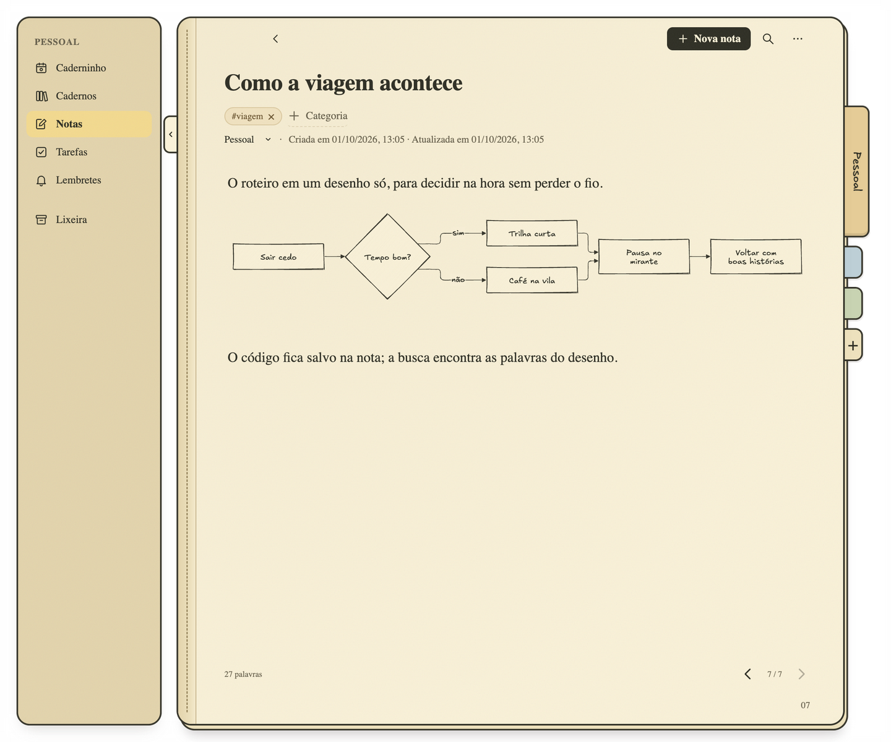

<p align="center">
  
</p>

<h1 align="center">Caderninho</h1>

<p align="center">
  A notebook for the Mac where tasks stay attached to the sentence that created them,<br>
  and related pages are found on your computer, not in the cloud.
</p>

<p align="center">
  <a href="docs/INSTALLATION.md">Install on Mac</a> ·
  <a href="docs/USER_GUIDE.md">User guide</a>
</p>

Caderninho keeps notes, task lists and reminders in notebooks, like most note apps. What it does differently:

- **Actions anchored to the text.** Select a passage, an image or a link and turn it into a task or a reminder. The passage stays highlighted, and the task always knows where it came from.
- **Related pages without uploading anything.** A language model and Apple's text recognition run on your Mac and link pages about the same subject, even when they use different words.
- **References placed on the page.** Images, PDFs and link cards sit beside the paragraph they belong to, and keep working offline.
- **Diagrams you can edit.** Flowcharts, sequences and mind maps are written as text and drawn in a hand-drawn style inside the note.
- **A daily page that remembers.** Each day gathers pending tasks, reminders and the latest note; earlier days stay readable as they were.
- **Your files, in one folder.** No account, no sync, no server. Back up by copying a folder.

The interface is in Portuguese. Caderninho runs on macOS.


## Tasks that remember why they exist

In most apps, writing "ask for two quotes" in a note and adding it to a to-do list are two separate things. Copy it over, and the list loses the context.

In Caderninho, you select the passage and create a **task** or a **reminder** from it. The action goes to the note's margin with a copy of the passage, and the passage gets a dashed highlight that turns green when the task is done. Images and link cards can also originate actions.

- Tasks appear in **Tarefas** and on the daily page; reminders appear in the calendar and play an alert at the scheduled time.
- **Ver origem** (View origin) opens the note and highlights the passage.
- A note can have several tasks and several independent alerts.
- If you rewrite or delete the passage later, the action keeps the copy and the margin tells you it no longer finds the original.

Dates written in Portuguese, such as `amanhã às 14h` or `05/10/2027 às 14:30`, get a **Agendar** (Schedule) stamp. Nothing is scheduled until you click it.

## Related pages, computed locally

After each save, Caderninho compares the page with the other notes, lists and reminders in the same notebook. It combines three signals: shared categories, shared words and the meaning of the text, which comes from a multilingual embedding model running on your CPU. Text inside images, read by the macOS Vision framework, also counts.


The two closest pages appear at the bottom of the note. The graph (**⌥⌘R**) puts the current page in the center and closer pages nearer to it; click one to open it. No text or image leaves your computer. The model is downloaded once, on first use; after that, it works offline.

## References next to the idea

Paste or drag an image, a PDF or a link into a note. Drag it beside the paragraph it belongs to, on the left or right, and resize it; the text flows around it.


- Files are copied into the app, so you can delete or move the original.
- PDFs show their title and first lines, extracted on your Mac; **Abrir PDF** opens the saved copy.
- Link cards save the page title, description and image once, and keep showing them offline. Caderninho reads the page metadata without running its scripts.

## Diagrams as text

Type `/diagrama` to insert a flowchart, sequence, mind map or timeline. You write the [Mermaid](https://mermaid.js.org) code, the drawing updates as you type, and errors keep the last valid drawing on screen. The diagram is stored as text in the note, so search finds its words and PDF export prints it. Everything renders locally.



## A daily page with history

**Caderninho**, the first screen, shows the notebook's most recently edited note, its related pages, pending tasks from every list and note margin, and today's reminders.


The next day starts a new page. Previous days stay available in the date picker, read-only, as a record of what was pending, done and scheduled on that day.

## Your data, in a folder

Notes, lists, reminders and categories live in a SQLite database; images and PDFs live next to it, in a media folder:

```text
~/Library/Application Support/caderninho/
```

There is no account and no cloud sync. To back up, close the app and copy that folder. Any page can be exported to PDF (**⇧⌘E**) with its formatting, tables, images, diagrams and linked actions.

The only network requests are the ones you trigger: fetching a link preview from the site you pasted, and the one-time model download for related pages.

## Limits to know

- macOS only, interface in Portuguese.
- Reminders play only while the app is open (it can be minimized). If an alert was missed while the app was closed or the Mac was asleep, it plays when the app comes back.
- No sync between computers and no mobile version.
- Related pages are found within the same notebook, not across notebooks.

---

[Install on Mac](docs/INSTALLATION.md) · [User guide](docs/USER_GUIDE.md)

The screenshots show the real app with fictional examples.
