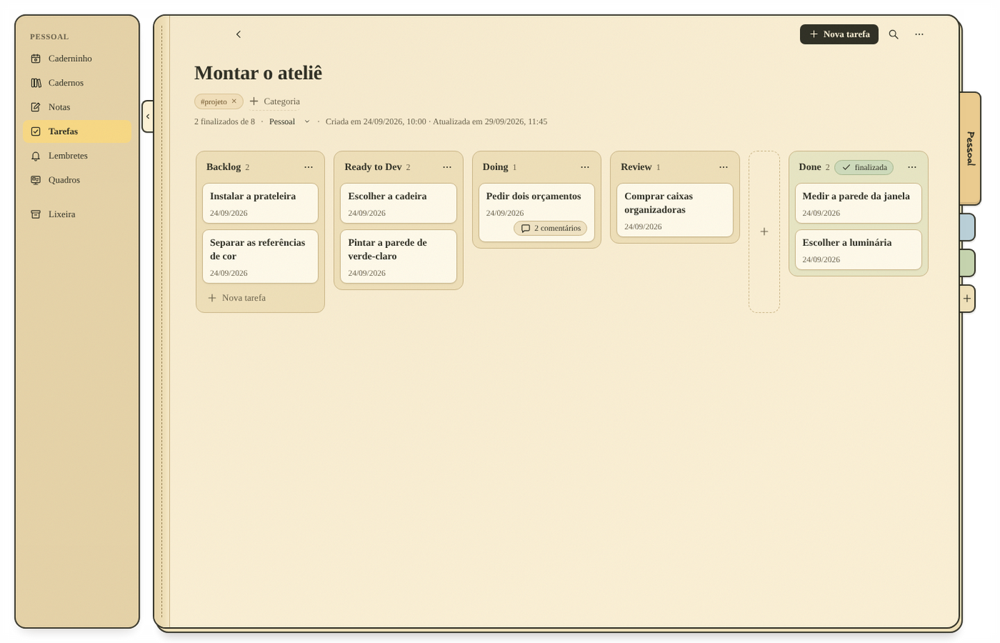
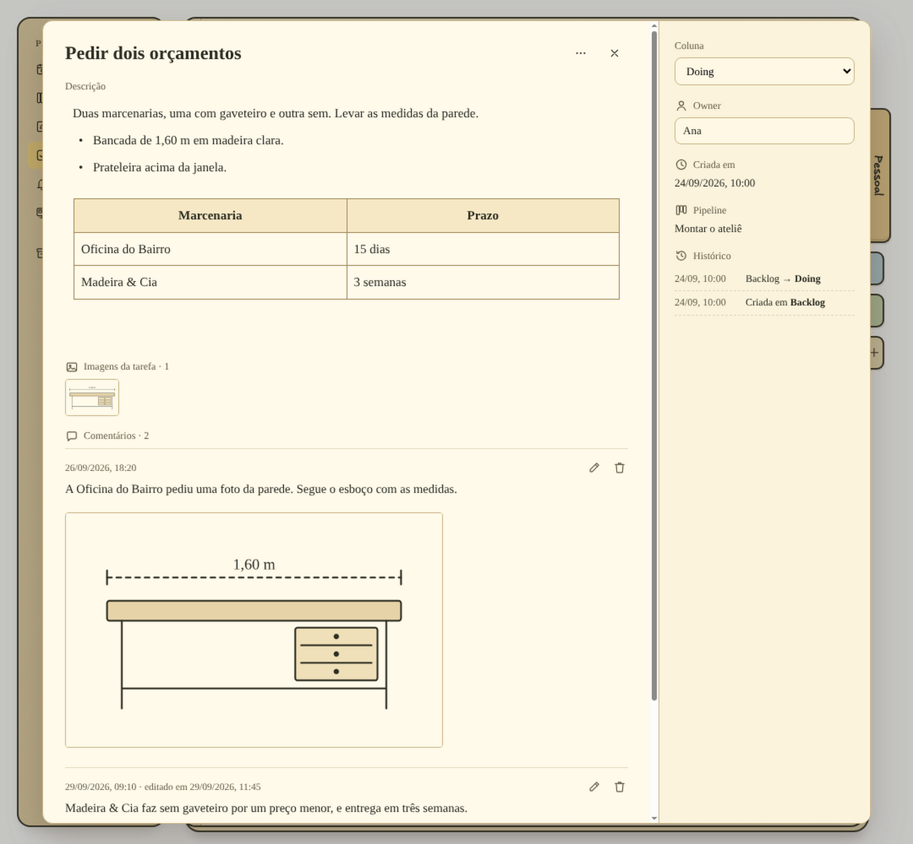
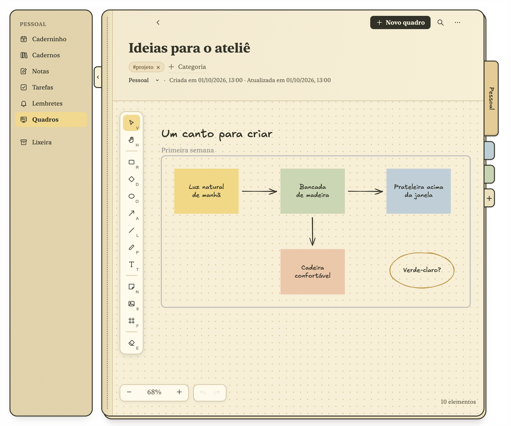

<p align="center">
  
</p>

<h1 align="center">Caderninho</h1>

<p align="center">
  Notas que viram tarefas sem perder o contexto.<br>
  Um caderno para o Mac, feito para quem escreve em português.
</p>

<p align="center">
  <a href="https://fagnermourafeitosa.github.io/caderninho/">Ver o site</a> ·
  <a href="docs/INSTALLATION.md">Instalar no Mac</a> ·
  <a href="docs/USER_GUIDE.md">Guia de uso</a>
</p>

<p align="center">
  <a href="https://buymeacoffee.com/caderninho"></a>
</p>

Você escreve "pedir dois orçamentos" numa nota sobre a reforma da cozinha. Três semanas depois, a tarefa está numa lista e ninguém lembra de qual reforma era, quais orçamentos, nem por quê.

No Caderninho, a tarefa nasce da própria nota e continua ligada a ela. Selecione um trecho, transforme em tarefa, e ela entra numa lista onde dá para ver, de relance, em que pé está cada coisa: o que ainda nem começou, o que está andando e o que já terminou. A nota mostra a situação da tarefa, e a tarefa sempre sabe de onde veio.

Para as ideias que pedem espaço, há os quadros: murais sem fim para post-its, setas, fluxos e organogramas. Notas, tarefas, lembretes e quadros ficam no mesmo caderno, tudo conectado.


## Tarefas que lembram por que existem

Na maioria dos apps, a nota e a lista de tarefas são coisas separadas. Copie uma linha de uma para a outra e a lista perde o contexto.

No Caderninho, você seleciona o trecho e cria a partir dele uma **tarefa** ou um **lembrete**. A tarefa entra numa das suas listas e aparece ao lado da nota, na margem, com uma cópia do trecho e a etapa em que está. O trecho fica destacado e ganha verde quando a tarefa termina. Imagens e cartões de link também podem virar tarefas.

- Comece uma linha com `[]` para criar uma tarefa sem parar de escrever. A linha passa a mostrar a etapa da tarefa.
- Seja pela seleção, pela margem, pelo botão direito ou por `[]`, abre o mesmo formulário **Nova tarefa**, com o título já preenchido e a lista mais recente do caderno escolhida.
- Os lembretes aparecem no calendário e tocam um alerta no horário marcado; **Ver origem**, na margem, abre a nota e destaca o trecho.
- Uma nota pode ter várias tarefas e vários alertas independentes.
- Se você reescrever ou apagar o trecho depois, a ação guarda a cópia e a margem avisa que não encontra mais o original.

## Listas que mostram em que pé está cada coisa

Em **Tarefas**, cada lista é organizada em colunas, uma para cada etapa do trabalho. Ela já começa com cinco etapas (**Backlog**, **Ready to Dev**, **Doing**, **Review** e **Done**), e você pode renomear, mudar de lugar, criar e remover etapas do jeito que fizer sentido para você. Para avançar uma tarefa, arraste-a para a próxima coluna; quando ela chega à última, está concluída. Basta olhar a lista para saber o que falta.



Clique numa tarefa para ver tudo sobre ela: a descrição, com listas, tabelas e imagens; os comentários, que você pode editar ou apagar; quem está cuidando dela; e o caminho que ela fez de uma etapa para outra.



## Uma página do dia que guarda o registro

**Caderninho**, a primeira tela, mostra em faixas que você pode recolher: a nota editada mais recentemente no caderno com as páginas relacionadas a ela, a lista de tarefas mais recente (dá para avançar as tarefas ali mesmo), os lembretes de hoje e as últimas notas.


No dia seguinte começa uma página nova. Os dias anteriores continuam disponíveis no seletor de datas, somente para leitura, exatamente como estavam: o que estava agendado e as notas daquele dia. Funciona como um diário que você nunca precisou escrever.

## Feito em português desde o início

A interface, a leitura de datas e a busca foram construídas para o português, não traduzidas para ele.

- Datas escritas na nota, como `amanhã às 14h` ou `05/10/2027 às 14:30`, ganham um selo **Agendar**. Nada é agendado até você clicar nele.
- A busca e as sugestões de categoria ignoram acentos e maiúsculas: `reuniao` encontra `reunião`.
- Hashtags como `#orçamento` viram categorias enquanto você digita.

## O que mais ajuda

**Páginas relacionadas, calculadas no seu Mac.** A cada salvamento, o Caderninho compara a página com as outras notas, listas de tarefas, quadros e lembretes do mesmo caderno, por categorias em comum, palavras em comum e significado, incluindo o texto dentro de imagens. As duas páginas mais próximas aparecem no fim da nota, e o grafo (**⌥⌘R**) mostra o restante. Nenhum texto ou imagem sai do seu computador.


**Referências ao lado da ideia.** Imagens, PDFs e cartões de link ficam ao lado do parágrafo a que pertencem, com o texto contornando. Os arquivos são copiados para o app, e os cartões de link continuam funcionando sem internet.


**Quadros para pensar no papel.** Um mural sem fim para post-its, setas, fluxos, organogramas, imagens e texto solto, com traço de mão. O quadro fica no mesmo caderno das notas e das tarefas: o texto dele aparece na busca e nas páginas relacionadas, e ele pode ser exportado em PNG ou SVG.



**Diagramas como texto.** Digite `/diagrama` para escrever um fluxograma, uma sequência, um mapa mental ou uma linha do tempo em [Mermaid](https://mermaid.js.org). O diagrama é desenhado com traço de mão dentro da nota, e a busca encontra as palavras dele.

## Seus dados, numa pasta

Notas, listas de tarefas, lembretes, quadros e categorias ficam num banco SQLite; imagens e PDFs ficam ao lado dele:

```text
~/Library/Application Support/caderninho/
```

Não há conta nem sincronização na nuvem. Para fazer backup, feche o app e copie essa pasta. Notas e lembretes podem ser exportados em PDF (**⇧⌘E**) com a formatação, as imagens, os diagramas e os lembretes ligados a eles; quadros, em PNG ou SVG.

As únicas requisições de rede são as que você dispara: buscar a prévia de um link no site que você colou e baixar uma única vez o modelo usado pelas páginas relacionadas.

## Limites

- Só para macOS, com interface em português.
- Os lembretes só tocam com o app aberto (pode estar minimizado). Um alerta perdido com o app fechado ou o Mac em repouso toca quando o app volta.
- Sem sincronização entre computadores e sem versão para celular.
- Listas de tarefas não são exportadas em PDF, e cada tarefa não tem categorias nem páginas relacionadas próprias.
- Ainda não importa notas de outros apps.
- As páginas relacionadas são buscadas dentro do mesmo caderno, não entre cadernos.

---

[Instalar no Mac](docs/INSTALLATION.md) · [Guia de uso](docs/USER_GUIDE.md)

Gostou do Caderninho? Você pode apoiar o projeto com um café:

<a href="https://buymeacoffee.com/caderninho"></a>

As capturas de tela mostram o app real com exemplos fictícios.

[MIT License](https://opensource.org/license/mit)
