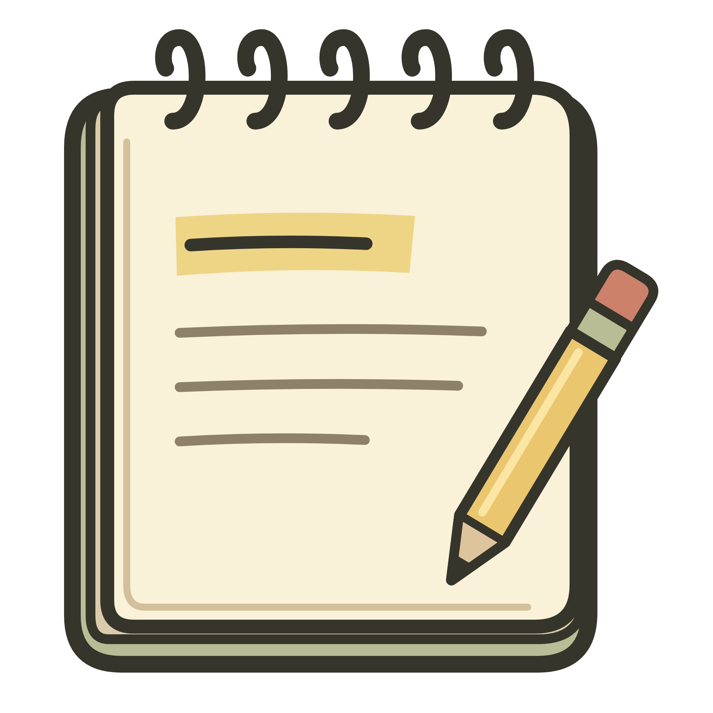
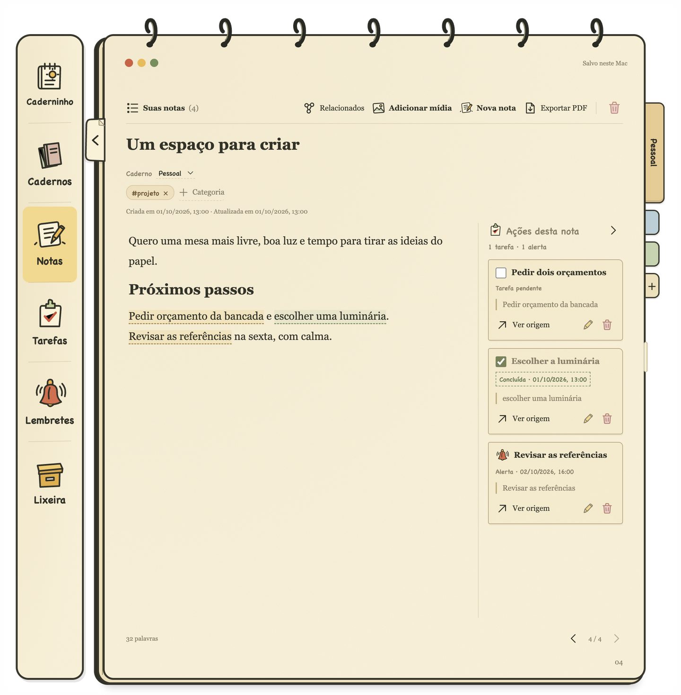
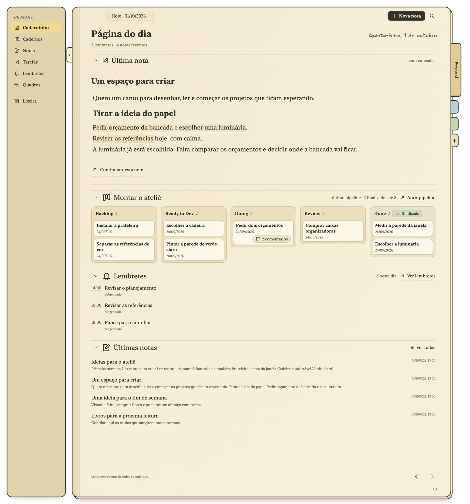
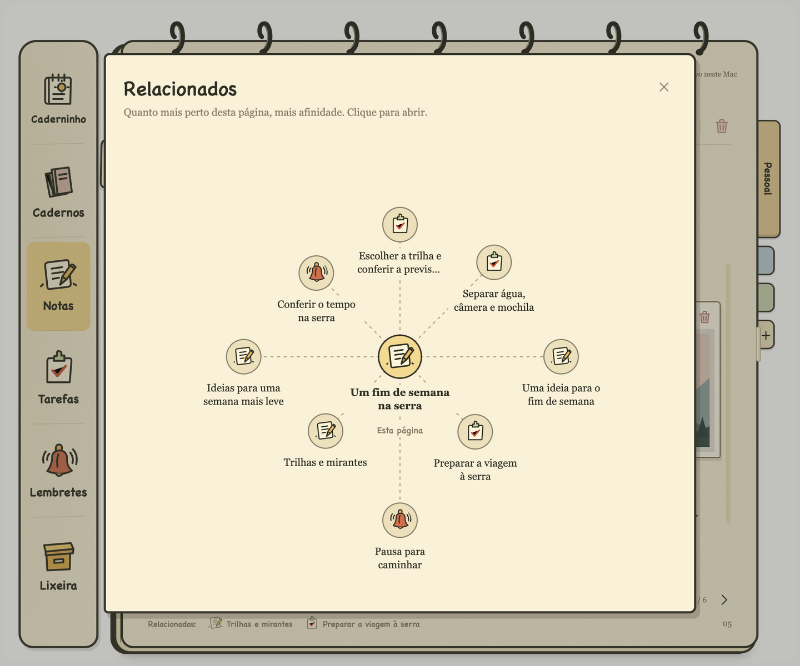
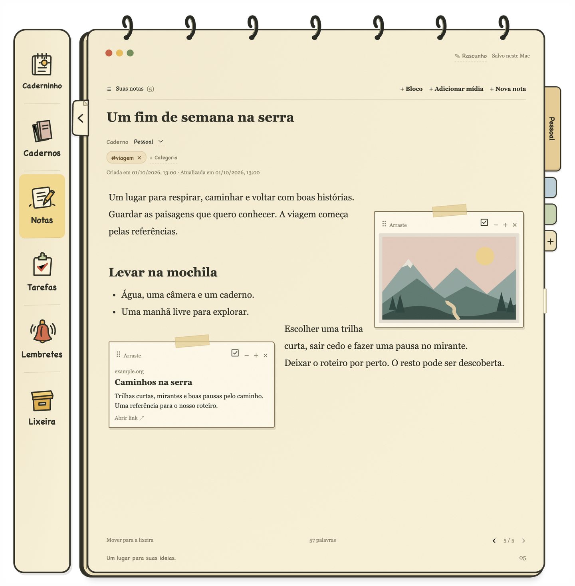

<p align="center">
  
</p>

<h1 align="center">Caderninho</h1>

<p align="center">
  Notes that turn into tasks without losing their context.<br>
  A notebook for the Mac, made for people who write in Portuguese.
</p>

<p align="center">
  <a href="docs/INSTALLATION.md">Install on Mac</a> ·
  <a href="docs/USER_GUIDE.md">User guide</a>
</p>

You write "ask for two quotes" in a note about the kitchen renovation. Three weeks later, the task sits in a list, and nobody remembers which renovation, which quotes, or why.

Caderninho keeps the task attached to the sentence that created it. Select a passage, turn it into a task or a reminder, and the task always knows where it came from. Everything else in the app supports that idea: a daily page that records what was pending, related pages found on your own computer, and references placed beside the paragraph they belong to.



## Tasks that remember why they exist

In most apps, a note and a to-do list are two separate things. Copy a line from one to the other, and the list loses the context.

In Caderninho, you select the passage and create a **task** or a **reminder** from it. The action goes to the note's margin with a copy of the passage, and the passage gets a dashed highlight that turns green when the task is done. Images and link cards can also originate actions.

- Tasks appear in **Tarefas** and on the daily page; reminders appear in the calendar and play an alert at the scheduled time.
- **Ver origem** (View origin) in the margin, or **Voltar à origem** (Back to origin) in lists and on the daily page, opens the note and highlights the passage.
- A note can have several tasks and several independent alerts.
- If you rewrite or delete the passage later, the action keeps the copy and the margin tells you it no longer finds the original.

## A daily page that keeps a record

**Caderninho**, the first screen, shows the notebook's most recently edited note, its related pages, pending tasks from every list and note margin, and today's reminders.



The next day starts a new page. Previous days stay available in the date picker, read-only, exactly as they were: what was pending, what got done and what was scheduled. It works like a journal you never had to write.

## Written in Portuguese, from the start

The interface, the date reading and the search are built for Portuguese, not translated into it.

- Dates written in a note, such as `amanhã às 14h` or `05/10/2027 às 14:30`, get an **Agendar** (Schedule) stamp. Nothing is scheduled until you click it.
- Search and category suggestions ignore accents and letter case: `reuniao` finds `reunião`.
- Hashtags such as `#orçamento` become categories as you type.

## What else helps

**Related pages, computed on your Mac.** After each save, Caderninho compares the page with the other notes, lists and reminders in the same notebook, by shared categories, shared words and meaning, including text inside images. The two closest pages appear at the bottom of the note, and the graph (**⌥⌘R**) shows the rest. No text or image leaves your computer.



**References beside the idea.** Images, PDFs and link cards sit next to the paragraph they belong to, with the text flowing around them. Files are copied into the app, and link cards keep working offline.



**Diagrams as text.** Type `/diagrama` to write a flowchart, sequence, mind map or timeline in [Mermaid](https://mermaid.js.org). It is drawn in a hand-drawn style inside the note, and search finds its words.

## Your data, in a folder

Notes, lists, reminders and categories live in a SQLite database; images and PDFs live next to it:

```text
~/Library/Application Support/caderninho/
```

There is no account and no cloud sync. To back up, close the app and copy that folder. Any page can be exported to PDF (**⇧⌘E**) with its formatting, images, diagrams and linked actions.

The only network requests are the ones you trigger: fetching a link preview from the site you pasted, and the one-time download of the model used for related pages.

## Limits to know

- macOS only, interface in Portuguese.
- Reminders play only while the app is open (it can be minimized). An alert missed while the app was closed or the Mac was asleep plays when the app comes back.
- No sync between computers and no mobile version.
- No import from other note apps yet.
- Related pages are found within the same notebook, not across notebooks.

---

[Install on Mac](docs/INSTALLATION.md) · [User guide](docs/USER_GUIDE.md)

The screenshots show the real app with fictional examples.
