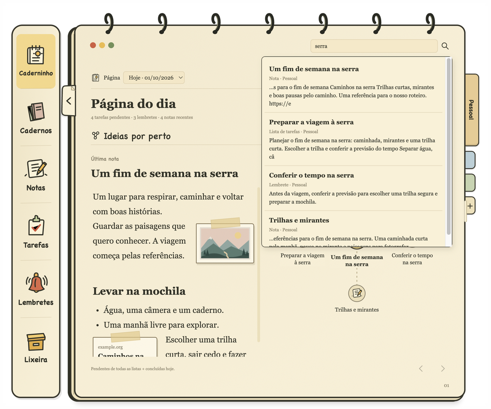

  

<h1 align="center">Caderninho</h1>

  <strong>Um lugar para suas ideias — e para o que nasce delas.</strong>

  Escreva, reúna referências e transforme trechos da página em próximos passos. 
  Tudo no seu computador, sem criar uma conta.

  <a href="#da-anotação-ao-próximo-passo">Conheça o Caderninho</a> ·
  <a href="docs/INSTALLATION.md">Instalação no Mac</a> ·
  <a href="docs/USER_GUIDE.md">Guia de uso</a>

## Da anotação ao próximo passo

Uma ideia vira tarefa sem precisar sair da nota. Selecione um trecho e crie uma tarefa ou um lembrete na margem. Uma imagem ou referência também pode dar origem a uma ação.

O trecho fica marcado na página, e a ação guarda o caminho de volta à origem. Você sabe **o que fazer e por que aquilo importa**, mesmo quando retoma o assunto dias depois.

As tarefas entram na Página do dia e os lembretes no calendário. Conclua, reagende ou volte à anotação que começou tudo.

## Ideias que encontram outras ideias

O Caderninho aproxima páginas que falam de assuntos parecidos, mesmo quando você usa palavras diferentes. Notas, listas e lembretes do mesmo caderno podem se conectar; o texto das imagens também ajuda a encontrar essas relações.

No rodapé, as páginas mais próximas vêm primeiro. No grafo, ficam mais perto do centro. Clique em uma delas e continue de onde aquela ideia te levou.

As conexões acompanham suas mudanças e são encontradas no seu computador, sem enviar o conteúdo das páginas para a nuvem.

## Referências com lugar na página

Uma paisagem, um roteiro, uma inspiração: cole ou arraste imagens e links para perto do que está escrevendo. Posicione os recortes e escreva ao redor, como num caderno de papel.

A referência fica junto da ideia que ela despertou. E, quando surgir algo para fazer a partir dela, a ação pode ficar ali também.

## O dia tem uma página própria

No topo, retome a última nota do caderno e explore as ideias ligadas a ela em um grafo. Logo abaixo, tarefas das suas listas e das margens das notas se encontram com os lembretes e as páginas recentes. Você acompanha o dia sem precisar abrir cada projeto para descobrir o que ficou pendente.

Amanhã, a página de hoje continua disponível para consulta. O retrato das tarefas, lembretes e notas daquele momento fica guardado.

## Um caderno para cada assunto

Separe projetos, estudos e vida pessoal em cadernos, com abas coloridas para trocar entre eles. Categorias atravessam as páginas de cada caderno: comece a escrever uma hashtag e encontre as que você já usa.

A lupa no topo encontra páginas pelo título ou pelo conteúdo em todos os cadernos, de qualquer seção. Cada resultado mostra um trecho e o caderno de origem; clique para retomar a página.

Quer levar uma página com você? Exporte para PDF e guarde ou compartilhe suas anotações, referências e ações com o mesmo fundo de papel.

## Seu caderninho fica com você

Sem conta e sem sincronização com a nuvem. Suas páginas e imagens ficam no seu computador; você pode escrever e consultar o que guardou sem internet.

A prévia de um link consulta o site indicado. As conexões entre páginas precisam de um download inicial para começar a funcionar; depois, também estão disponíveis sem internet.

Veja como instalar no [guia para Mac](docs/INSTALLATION.md) e conheça os detalhes no [guia de uso](docs/USER_GUIDE.md).

---

As imagens mostram o aplicativo real com exemplos fictícios.
