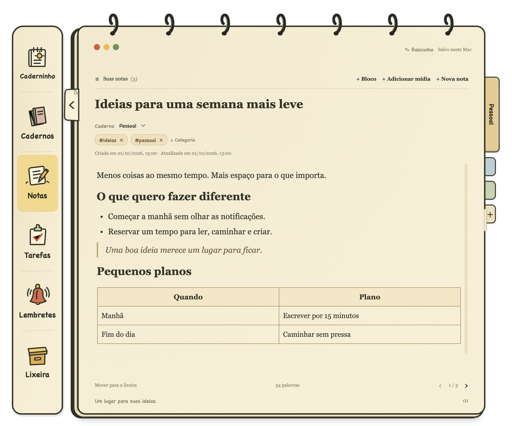
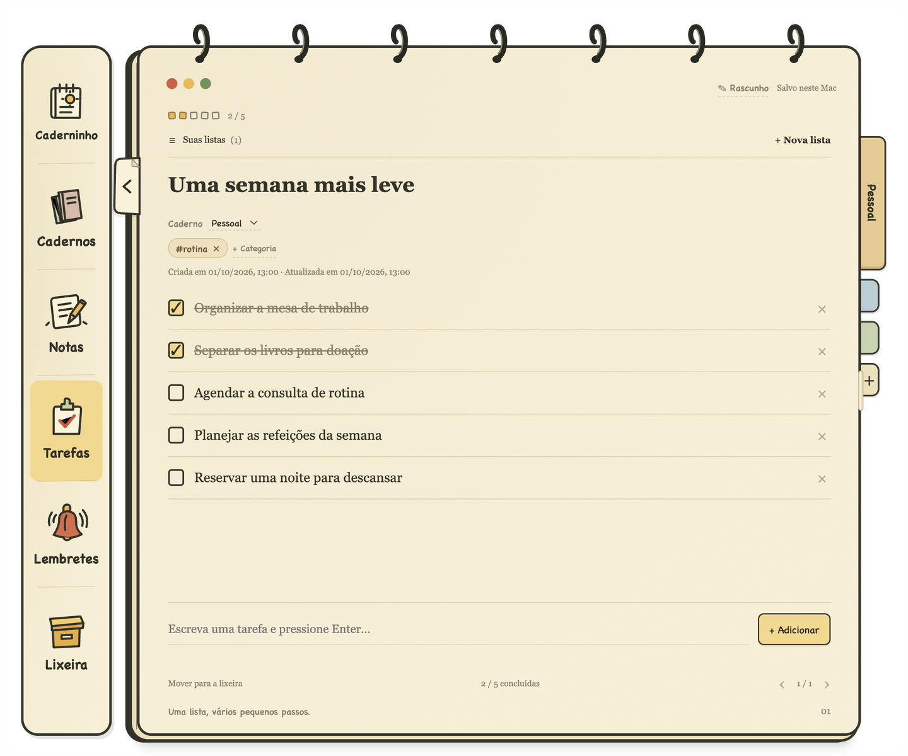
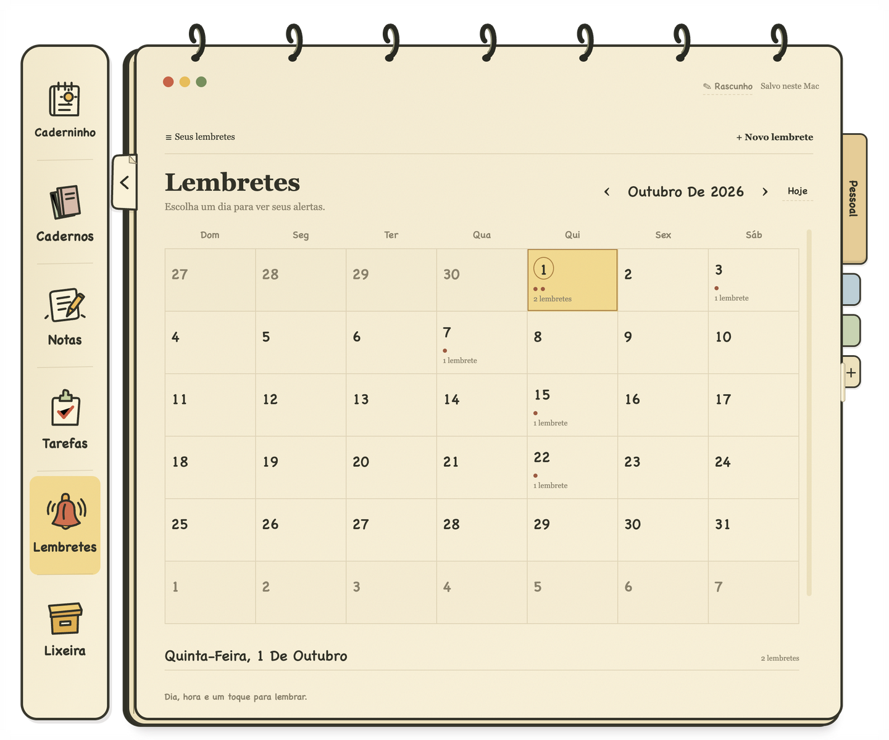

  

<h1 align="center">Caderninho</h1>

  <strong>Notas, tarefas e lembretes. Tudo no seu computador.</strong>

  Organize seus projetos em cadernos, capture ideias e acompanhe o dia. 
  Sem criar uma conta. Sem enviar suas páginas para a nuvem.

  <a href="#seu-dia-em-uma-página">Conheça o aplicativo</a> ·
  <a href="docs/INSTALLATION.md">Instalação no Mac</a> ·
  <a href="docs/USER_GUIDE.md">Guia de uso</a>

## Seu dia em uma página

Comece com uma visão do que merece atenção: tarefas pendentes, itens concluídos, lembretes e suas últimas notas. Um espaço livre de escrita permite registrar ideias e acontecimentos sem sair dessa tela.

No dia seguinte, a página anterior continua disponível para consulta. Você acompanha o presente sem perder o que ficou para trás.

## Escreva uma ideia. Dê forma a ela.

Uma nota pode começar com uma frase e ganhar títulos, listas, checkboxes, citações e tabelas. Selecione o texto para formatar ou digite `/` para encontrar o bloco de que precisa, direto na página.

- **Editor com formatação:** negrito, itálico, sublinhado, tachado, links, código e marca-texto.
- **Tabelas com seleção visual:** escolha linhas e colunas passando o mouse pela grade.
- **Imagens e cartões de links:** cole ou arraste conteúdos para perto das suas anotações.
- **Categorias no texto:** escreva `#ideias` ou `#trabalho` para organizar a página enquanto escreve.
- **Salvamento automático:** acompanhe a confirmação de salvamento sem interromper a escrita.

## Transforme planos em próximos passos

Crie listas independentes para a rotina, um projeto ou uma viagem. Cada lista tem título, categorias e seus próprios itens, com progresso e registro de conclusão.

As tarefas também aparecem na Página do dia. Marque uma delas ali e a lista original acompanha a mudança.

## Lembre do que importa, na hora certa

Consulte os compromissos no calendário mensal e abra a nota por trás de cada lembrete. Agende dia e hora para receber um alerta sonoro.

Escreveu `amanhã às 14h` em uma nota? O Caderninho oferece um carimbo para agendar o lembrete. Você confere a data e decide quando ativá-lo.

> Para emitir alertas, o aplicativo precisa estar aberto, mesmo que minimizado. Se o horário passar com o app fechado ou o computador dormindo, o alerta será emitido quando ele voltar a funcionar.

## Um caderno para cada parte da sua vida

Separe trabalho, estudos e projetos pessoais em cadernos com nome, descrição e cor. As abas laterais deixam a troca de contexto sempre à mão, e você pode mover páginas entre cadernos quando seus planos mudarem.

| Recurso | O que você ganha |
| --- | --- |
| **Rascunho instantâneo** | Capture uma ideia com `⌘ Shift Espaço` e transforme-a em uma nota depois. |
| **Categorias reutilizáveis** | Identifique assuntos com etiquetas abaixo do título ou hashtags no texto. |
| **Página do dia** | Reúna tarefas, lembretes e anotações em uma visão diária. |
| **Lixeira por tipo** | Recupere páginas, itens de tarefas e mídias removidos. |
| **Datas de atividade** | Consulte quando uma página foi criada, atualizada ou uma tarefa foi concluída. |

## Seus dados ficam com você

O Caderninho guarda suas páginas em **SQLite** e suas imagens em uma pasta local. Não há conta, servidor de armazenamento nem sincronização com a nuvem.

Você pode escrever, organizar e consultar o conteúdo salvo **sem internet**. A criação de uma prévia de link acessa apenas o site indicado para obter título, descrição e imagem; suas notas não são enviadas nessa consulta.

O backup fica sob seu controle: basta copiar a pasta de dados com o aplicativo fechado. O [guia de uso](docs/USER_GUIDE.md#seus-dados-ficam-no-seu-computador) explica onde ela fica e como restaurá-la.

## Comece a usar

O aplicativo pode ser gerado e instalado no macOS a partir deste projeto. Consulte as [instruções de instalação](docs/INSTALLATION.md).

Quer conhecer os detalhes antes de começar? Veja o [guia de uso](docs/USER_GUIDE.md), com atalhos, organização de cadernos, mídia e lembretes.

---

As capturas mostram o aplicativo real com dados fictícios de demonstração. Para executar testes ou contribuir com o código, consulte o [guia de desenvolvimento](docs/DEVELOPMENT.md).
