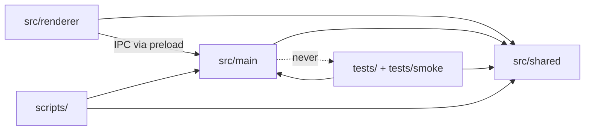

# Specification: Project Structure Reorganization

- **Specification ID**: 001
- **Date**: 2026-10-04
- **Slug**: project-structure
- **Status**: Implemented
- **Owner**: Project tooling (repository layout, packaging, test harness)
- **Related Specification**: none

---

## Context & Background

All application source files (main process, preload, shared modules, renderer scripts, styles and `index.html`) live flat in the repository root, next to documentation, tooling and configuration: 38 tracked files at the top level. The main process entry `main.cjs` (475 lines) also embeds the Electron smoke-test runner, which reads scenario scripts from `tests/` and `require`s `tests/pdf-fixture.cjs`.

This specification only reorganizes files. It does not change runtime behavior, IPC contracts, the SQLite schema, the renderer's global-script loading model or the internals of any module. Migration to bounded contexts with DDD layers is deferred to future specifications, one context at a time.

---

## Problem Statement

### 1. Root directory mixes every concern

Main-process code, renderer code, shared modules, product/design documents and tooling scripts share one directory. Process boundaries are invisible, and new files have no obvious home.

### 2. Test harness inside the production entry point

`main.cjs` contains about 245 lines of smoke-test orchestration (scenario dispatch, native input simulation, screenshot capture) and `require`s a file from `tests/`. This violates the AGENTS.md rules "No Dev Code in Production Paths" and "File Responsibility Limits" (> 350 lines).

### 3. Packaging uses a denylist

`npm run package` excludes known paths with `--ignore`. Any new root file is shipped inside the `.app` unless someone remembers to add it to the denylist.

---

## Solution

1. Move application code under `src/`, one folder per Electron process, without subfolders:
   - `src/main/`: main process, preload, persistence and related-content modules.
   - `src/shared/`: modules loaded by both processes (UMD pattern).
   - `src/renderer/`: `index.html`, styles and renderer scripts.
2. Move `PRODUCT.md`, `DESIGN.md` and `ROADMAP.md` to `docs/`, and `generate-icon.cjs` to `scripts/`.
3. Extract the smoke-test runner from `main.cjs` into `tests/smoke/`. `main.cjs` exports a minimal test hook (window, services, alarm count, history dispatch, observed-day setter). The existing `smoke` runtime branches inside IPC handlers remain unchanged.
4. The smoke-test entry becomes `electron tests/smoke/run.cjs --smoke-test [scoped flag]`, keeping every existing scoped flag name.
5. Packaging switches to an allowlist: only `src/`, `assets/`, `node_modules/` and `package.json` enter the app bundle; `native/caderninho-ocr` and `assets/alarm.wav` remain extra resources.
6. Update every path reference: `package.json`, `require` calls, `__dirname`-based resource paths, `index.html` asset references, tests, scripts, `AGENTS.md`, `README.md` and `docs/`.



---

## Practical Gains & Operational Outcomes

1. **Discoverability**:
   - *Before*: 38 files at the root; process ownership inferred from file extensions.
   - *Now*: the root holds only configuration and entry documents; the folder states the process that owns each file.

2. **Production Boundary**:
   - *Before*: the production entry point carries the test harness and loads a file from `tests/`.
   - *Now*: production modules never load test code; `main.cjs` is under 350 lines.

3. **Packaging Safety**:
   - *Before*: new root files leak into the `.app` by default.
   - *Now*: only allowlisted paths are packaged.

---

## User Stories

- [x] 1. As a developer, I want application code grouped by Electron process, so that I know where each file belongs and which APIs it may use.
- [x] 2. As a developer, I want the repository root to contain only configuration and entry documents, so that the project is easy to navigate.
- [x] 3. As a developer, I want the smoke-test runner outside the production entry point, so that production code never loads test code.
- [x] 4. As a developer, I want to run the same smoke-test scopes with the same flag names, so that existing workflows keep working.
- [x] 5. As a maintainer, I want packaging to include only allowlisted paths, so that development files never ship inside the app.
- [x] 6. As a user, I want the app to behave exactly as before, so that the reorganization is invisible to me.

---

## Architecture Gate

### 1. Bounded Context & Ubiquitous Language
- **Context**: none. Structural change only; no domain behavior is added or modified. Bounded contexts are defined by future specifications.
- **Package Ownership**:
  | Path | Responsibility |
  | :--- | :--- |
  | `src/main/main.cjs` | Electron app lifecycle, window creation, IPC handlers, test hook export |
  | `src/main/preload.cjs` | `contextBridge` API exposed to the renderer |
  | `src/main/store.cjs`, `notebooks.cjs`, `categories.cjs`, `source-actions.cjs`, `temporal.cjs` | SQLite persistence and temporal records |
  | `src/main/media.cjs` | Local media blobs, PDF metadata and link previews |
  | `src/main/pdf-export.cjs` | Page export to PDF |
  | `src/main/window-move.cjs` | Window drag position calculation |
  | `src/main/related-config.cjs`, `related-engine.cjs`, `related-service.cjs`, `related-worker.cjs` | Local related-content computation |
  | `src/shared/smart-text.js`, `editor-document.js`, `category-text.js` | Pure modules shared by both processes |
  | `src/renderer/` | `index.html`, `style.css`, `controls.css` and the renderer scripts |
  | `tests/smoke/run.cjs` | Smoke-test entry: boots the app in smoke mode and dispatches scoped scenarios |
  | `tests/smoke/native-editor.cjs` | Native keyboard/mouse editor scenario |
  | `scripts/generate-icon.cjs` | Icon generation from `assets/icon.svg` |
  | `docs/PRODUCT.md`, `docs/DESIGN.md`, `docs/ROADMAP.md` | Product, design and roadmap references |
- **Ubiquitous Terms**:
  - `Smoke mode`: the app started with `--smoke-test`, using an isolated temporary `userData` directory.
  - `Test hook`: the minimal object exported by `src/main/main.cjs` for the smoke runner.

### 2. Aggregate Root & State Transitions
- **Entities & State Machine**: unchanged.
- **Invariants**: no runtime behavior changes; production modules never `require` files from `tests/`, `scripts/` or `artifacts/`.

### 3. Commands, Queries & Domain Ports
- Unchanged. The only new export is the test hook:
```javascript
/** @typedef {{ context(): { win, store, media, related, alarmCount }, ready: Promise<void>, dispatchHistory(direction, targetWindow), setObservedDay(day) }} TestHook */
```

### 4. IPC Contract & External Input Validation
- No IPC channel is added, removed or changed.

---

## Implementation Decisions

1. Flat folders per process; no subfolders inside `src/main`, `src/shared` or `src/renderer`.
2. The renderer keeps the ordered global `<script defer>` model; only paths change. Shared modules are referenced from `index.html` as `../shared/<file>`.
3. Resource paths built from `__dirname` resolve from the project root (`src/main/../..`) for `assets/`, `native/` and `artifacts/`. `index.html` is loaded by absolute path.
4. Smoke scenario scripts stay at `tests/*-smoke.js`; `tests/pdf-fixture.cjs` stays in `tests/`.
5. The `if (smoke)` branches inside IPC handlers and reminders are kept as they are.
6. File responsibility limits: `src/main/main.cjs` must end below 350 lines. `src/main/store.cjs` (378 lines) is a pre-existing exception owned by the persistence layer; its split is deferred to the specification that migrates persistence to a bounded context.
7. `npm run test:app` becomes `electron tests/smoke/run.cjs --smoke-test`; scoped flags are passed after `--`.

---

## Testing Decisions

### Approved TDD Exception
- This specification has no behavior change and no Red phase. The user declined an architecture test (grilling round 1, Q6). Verification relies on the existing suites and the packaged app.

### Unit & Integration Tests
- `npm test` passes with updated `require` paths.

### Smoke Tests
- `npm run test:app` (full suite) passes.
- Each scoped mode passes: `--native-only`, `--source-only`, `--editor-only`, `--search-only`, `--home-preview-only`, `--related-only`, `--notebooks-only`, `--pdf-cuts-only`, `--pdf-only`, `--category-autocomplete-only`, `--categories-only`.

### Packaging
- `npm run package` succeeds; the bundle contains no `tests/`, `scripts/`, `docs/`, `artifacts/` or `specs/`.
- The user opens the packaged `.app` and confirms it behaves as before.

### Regression Tests
- `scripts/capture-readme.cjs`, `scripts/check-embedding.cjs` and `npm run icon` resolve their new paths.

---

## Acceptance Criteria

- [x] 1. The repository root contains only `package.json`, `package-lock.json`, `README.md`, `AGENTS.md`, `CLAUDE.md`, `.gitignore` and the directories `src/`, `tests/`, `scripts/`, `docs/`, `specs/`, `assets/`, `native/` (plus ignored `node_modules/`, `dist/`, `artifacts/` and hidden tool folders).
- [x] 2. No file under `src/` loads anything from `tests/`, `scripts/` or `artifacts/`.
- [x] 3. `src/main/main.cjs` has fewer than 350 lines.
- [x] 4. All unit, integration and smoke tests pass, including every scoped smoke mode.
- [x] 5. `npm run package` succeeds with the allowlist and the user confirms the packaged app works.
- [x] 6. `AGENTS.md`, `README.md` and `docs/` reference the new paths and commands.
- [x] 7. Quality checks (`npm test` on Node 22+, `node --check` on changed files) pass with 0 errors.

---

## Out of Scope

- Bounded contexts and DDD layers for existing code.
- Removing the `smoke` runtime branches from IPC handlers (dependency injection of sound, save dialog and related scheduling).
- Migrating renderer scripts to ES modules or adding a bundler.
- Splitting `store.cjs` or any file other than `main.cjs`.
- Moving smoke scenario scripts out of `tests/`.

---

## Further Notes

- Verification (2026-10-04): `npm test` 54/54; full `npm run test:app` and all 11 scoped modes passed; `npm run package` produced a bundle containing only `src/`, `assets/`, `node_modules/` and `package.json`. `--related-runtime-only` was not run (requires the model download).
- Superseded in the same delivery: the app no longer has a smoke mode. `tests/smoke/sandbox.cjs` isolates `userData` and the runner replaces sound, notifications, related scheduling, the PDF save dialog and the desktop cursor through `testHook.configure`; `tests/production-boundary.test.cjs` guards `src/`.
- Behavior change shipped alongside (commit `ec59b68`): the window resizes from the drawn book border on every edge and corner, with visible bottom and corner grips.
- Approved by the user on 2026-10-04; `npm run package` re-run after the sandbox change with the same allowlisted bundle.
- Approved exceptions: no Red phase (see Testing Decisions); `store.cjs` above 350 lines until its persistence specification.
