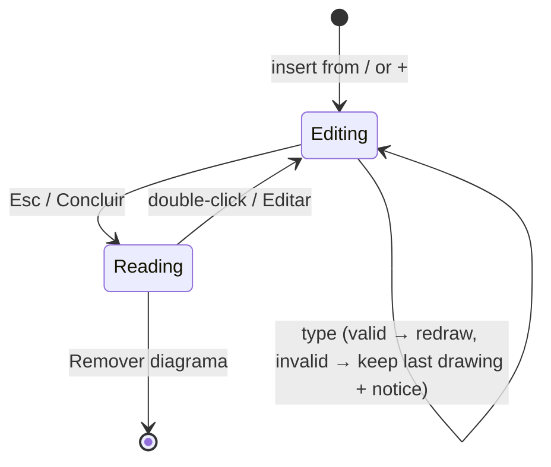

# Specification: Mermaid Diagrams in Notes

- **Specification ID**: 002
- **Date**: 2026-10-04
- **Slug**: mermaid-diagrams
- **Status**: Implemented
- **Owner**: Editor (page blocks), PDF export, search and related content
- **Related Specification**: none

---

## Context & Background

Notes store a structured page document (`editorDoc`) in SQLite next to a plain-text mirror (`body`) used by search and related content. Block types are `paragraph`, `h1`–`h3`, `bullet`, `number`, `quote`, `code`, `divider`, `check` and `table`. The table is the closest model: a non-editable block inside the continuous page, with its own tools (`+ Linha`, `+ Coluna`, `Cabeçalho`, `Remover tabela`), inserted from the `/` and `+` command palette.

Mermaid diagrams were requested on 2026-10-01 and kept in `docs/ROADMAP.md` until now. The roadmap requires: the official `mermaid` library bundled with the app, an action to add a diagram, a code editor with preview and syntax validation, re-editing after insertion, code stored in SQLite and rendered to SVG locally, offline operation without CDN or cloud, and the notebook visual style.

Facts that shape the design:
- The renderer Content Security Policy allows only `script-src 'self'`; the library must ship inside the app.
- The `mermaid` npm package (12.1.0) is 122 MB unpacked, with its own dependency tree. Packaging currently includes all of `node_modules/`.
- PDF export builds HTML in the main process (no DOM) and prints it in an offscreen `WebContentsView` from a private temporary file.

---

## Problem Statement

### 1. No way to draw structure
Flows, sequences, mind maps and timelines can only be written as text or tables. The notebook has no visual diagram.

### 2. Diagrams from elsewhere break the notebook
Pasting screenshots of diagrams makes them static images: they cannot be edited, are not searchable and do not follow the notebook style.

---

## Solution

1. **Insert**: a `Diagrama` command in the `/` and `+` palette (section `Estrutura`), with accent-insensitive aliases `diagrama mermaid fluxograma fluxo sequência mapa mental linha do tempo gráfico`.
2. **Start from a template**: a new diagram opens in edit mode with template choices: `Fluxograma`, `Sequência`, `Mapa mental`, `Linha do tempo` and `Em branco`.
3. **Edit inline**: the block expands in place, with the drawing on top and the code below in a monospace field. The drawing updates while typing (≈300 ms debounce). `Esc` or `Concluir` closes edit mode; double-clicking the drawing reopens it.
4. **Errors without loss**: invalid code keeps the last valid drawing visible, dimmed, with a notebook-style notice (cream paper, dark ink, 16px) stating the error line in Portuguese. The code is always saved.
5. **Notebook look**: Mermaid's hand-drawn look with the notebook's ink and paper palette. Diagram types without hand-drawn support use the same palette with Mermaid's classic look.
6. **Read mode**: the drawing fits the page width; above about 480px of height it scrolls inside the block. Hover tools: `Editar`, `Copiar código`, `Remover diagrama`.
7. **Everywhere the page appears**: the read-only home preview shows the drawing; PDF export prints it; global search finds text in the diagram code; related content ignores diagram code.



---

## Practical Gains & Operational Outcomes

1. **Visual thinking in the page**:
   - *Before*: structure only as text, lists or tables.
   - *Now*: editable diagrams live in the same page, next to the text that explains them.
2. **Durable and searchable**:
   - *Before*: diagram screenshots are opaque images.
   - *Now*: the code is saved in SQLite, found by search and printed in PDF.
3. **Offline and private**:
   - *Now*: rendering happens locally with a bundled library; no content leaves the machine.

---

## User Stories

- [x] 1. As a writer, I want to insert a diagram from the `/` or `+` palette, so that I can draw without leaving the page.
- [x] 2. As a writer, I want to find the command by typing `fluxograma`, `mermaid` or `sequencia` without accents, so that I do not need to remember its exact name.
- [x] 3. As a writer, I want to start from a flowchart, sequence, mind map or timeline template, so that I do not need to remember Mermaid syntax.
- [x] 4. As a writer, I want a blank option, so that I can paste or type my own Mermaid code.
- [x] 5. As a writer, I want to see the drawing update while I type, so that I understand the effect of each change.
- [x] 6. As a writer, I want invalid code to keep my last drawing and tell me the error line in plain Portuguese, so that a typo never makes my diagram disappear.
- [x] 7. As a writer, I want my code saved even while it is invalid, so that I never lose what I typed.
- [x] 8. As a writer, I want to close edit mode with `Esc` or `Concluir`, so that the page reads cleanly again.
- [x] 9. As a writer, I want to double-click a diagram or use `Editar` to change it later, so that diagrams stay editable.
- [x] 10. As a writer, I want to copy the diagram code, so that I can reuse it elsewhere.
- [x] 11. As a writer, I want to remove a diagram with a visible tool, so that I do not depend on selecting it.
- [x] 12. As a writer, I want undo/redo to include diagram changes, insertion and removal, so that mistakes are reversible.
- [x] 13. As a writer, I want diagrams drawn in the notebook's hand-drawn style and colors, so that they look like part of the notebook.
- [x] 14. As a writer, I want large diagrams to fit the page width and scroll inside their block, so that they never break the page layout.
- [x] 15. As a writer, I want any diagram type Mermaid supports to work, so that I am not limited to the templates.
- [x] 16. As a reader, I want diagrams in exported PDFs, so that shared pages are complete.
- [x] 17. As a reader, I want the home preview of the latest note to show its diagrams, so that the preview is faithful.
- [x] 18. As a writer, I want global search to find words inside a diagram, so that I can locate the page by a node label.
- [x] 19. As a writer, I want related pages to ignore diagram syntax, so that Mermaid keywords do not create false connections.
- [x] 20. As a user, I want diagrams to work offline without sending content anywhere, so that my notes stay private.
- [x] 21. As a maintainer, I want only the minified Mermaid build inside the packaged app, so that the app does not grow by the full npm package.

---

## Architecture Gate

### 1. Bounded Context & Ubiquitous Language
- **Context**: Editor (page document blocks), with consumers in PDF export, search and related content.
- **Package Ownership**:
  | Area | Responsibility |
  | :--- | :--- |
  | Shared page document module | `diagram` block type: normalization, limits and plain-text mirror |
  | Renderer diagram module (new) | Mermaid configuration and theme, rendering, error mapping, edit/read modes, templates, hover tools |
  | Renderer block editor | Palette command, insertion, serialization of the diagram block, undo integration |
  | Main PDF export | Diagram placeholders in the generated HTML and rendering inside the print view |
  | Main related engine | Document text without diagram code |
  | Vendoring script (new) | Copies the pinned minified Mermaid build into the app's renderer vendor folder |
- **Ubiquitous Terms**:
  - `Diagram block`: a page block of type `diagram` holding Mermaid code.
  - `Drawing`: the SVG rendered from the code, never persisted.
  - `Last valid drawing`: the most recent successful drawing kept on screen while the code is invalid.
  - `Template`: starter Mermaid code offered when a diagram is inserted.

### 2. Aggregate Root & State Transitions
- **Entities & State Machine**: the note's page document is the aggregate. A diagram block moves between `Editing` and `Reading` (UI state only, not persisted); its persisted state is only `{ id, type: 'diagram', code }`.
- **Invariants**:
  - The code is the single source of truth; the drawing is never stored in SQLite.
  - Code is stored as typed, valid or not, up to 20,000 characters per diagram; the existing page limits (1,000 blocks, 200,000 characters of text, 2 MB of JSON) still apply.
  - The plain-text mirror of a diagram block is a fenced block: three backticks plus `mermaid`, the code, and closing backticks.
  - A diagram never executes links, click handlers or scripts, and never loads remote resources.

### 3. Commands, Queries & Domain Ports
```javascript
/** @typedef {{ id: string, type: 'diagram', code: string }} DiagramBlock */
/** @typedef {{ ok: true, svg: string } | { ok: false, line: number|null, message: string }} DiagramRender */
/** @typedef {{ render(id: string, code: string): Promise<DiagramRender> }} DiagramRenderer */
```

### 4. IPC Contract & External Input Validation
- No IPC channel is added. Diagram blocks travel inside the existing `editorDoc` of `note:update` and are validated by the shared page document normalization in the main process:
  - `type` must be `diagram`; `code` must be a string of at most 20,000 characters, otherwise the update is rejected with a readable message.
  - Unknown fields are dropped.
- `notebook:export-pdf` is unchanged; it reads diagram code from the saved snapshot.

---

## Implementation Decisions

1. `diagram` is a new page block type, modeled after the table block: a non-editable container inside the continuous page, with its own tools; ordinary writing blocks remain in the shared contenteditable host.
2. The code field is a plain textarea inside the block, excluded from page-level text selection and formatting, with spellcheck disabled.
3. Mermaid is initialized once with `startOnLoad: false`, `securityLevel: 'strict'`, `htmlLabels: false` and the hand-drawn look, plus theme variables taken from the notebook palette (paper, ink, edge, accent) and the notebook body font. No `click`, links or remote fonts.
4. Rendering is debounced (≈300 ms) while editing and sequential across blocks on page render, so a page with several diagrams does not block typing.
5. Parse/render errors are mapped to a short Portuguese message plus line number when Mermaid provides it; raw library messages and stacks never reach the UI.
6. Insertion records one undo step; an edit session (from entering to leaving edit mode) records one undo step from the code before to the code after; removal records one undo step.
7. Templates are fixed starter code for flowchart, sequence, mind map and timeline, with neutral example labels in Portuguese; `Em branco` starts with empty code.
8. Inserting a diagram as the last block appends an empty paragraph after it, as tables and dividers do.
9. PDF export emits a placeholder per diagram with its code, escaped, and loads the bundled Mermaid build inside the offscreen print view; the view renders all placeholders before `printToPDF`. Its generated HTML carries a CSP that allows only the local script and no network. Invalid code prints the code as a code block with a short note.
10. The home preview reuses the editor's read-mode rendering.
11. Global search keeps using the plain-text mirror, so it finds words in diagram code. The related engine builds its text from the page document excluding diagram blocks.
12. Mermaid is a pinned exact-version dev dependency. A vendoring script copies only its minified browser build into a git-ignored renderer vendor folder; it runs before `start`, `test:app` and `package`. Packaging continues to allowlist `src/`, which now carries the vendored file; the full Mermaid package and its dependencies never enter the bundle.
13. File responsibility limits: diagram logic lives in its own renderer module (target ≤ 250 lines), not in the block editor.

---

## Testing Decisions

### Unit Tests
- Page document normalization accepts `{ type: 'diagram', code }`, drops unknown fields, rejects non-string code and code above 20,000 characters.
- The plain-text mirror of a diagram block is the fenced `mermaid` block; reconciliation keeps diagram blocks intact.
- Related engine document text excludes diagram code and keeps the surrounding text.
- PDF HTML builder escapes diagram code and emits one placeholder per diagram; the generated HTML references only the local Mermaid build and forbids network access.

### Smoke Tests (new scenario `diagram-smoke.js`, scoped flag `--diagram-only`, also in the full run)
- Insert from the `/` palette by typing `fluxograma`; choose the flowchart template; a drawing appears.
- Typing valid code updates the drawing; typing invalid code keeps the last drawing dimmed and shows the notice with a line number; the invalid code persists in SQLite.
- `Esc` leaves edit mode; double-click reopens it; `Copiar código` places the code on the clipboard; `Remover diagrama` removes the block.
- Undo/redo restores insertion, an edit session and removal.
- The diagram persists after reopening the store; global search finds a node label; the home preview shows the drawing.
- PDF export of a page with a diagram succeeds and the PDF contains the diagram labels.
- No uncaught renderer errors (`window.smokeErrors` empty).

### Packaging
- `npm run package` succeeds; the bundle contains the vendored Mermaid build and does not contain `node_modules/mermaid`.

### Regression Tests
- Existing unit tests and every smoke scope pass unchanged, including tables, code blocks, PDF export and the home preview.

---

## Acceptance Criteria

- [x] 1. A diagram can be inserted from the `/` and `+` palette, started from any of the five template choices, edited with live preview, and re-edited later.
- [x] 2. Invalid code never removes the last valid drawing, shows a readable Portuguese notice with the line, and is saved.
- [x] 3. Diagrams use the hand-drawn look with the notebook palette, fit the page width and scroll beyond about 480px of height.
- [x] 4. Undo/redo covers insertion, edit sessions and removal.
- [x] 5. Diagrams appear in exported PDFs and in the home preview.
- [x] 6. Global search finds diagram text; related content ignores diagram code.
- [x] 7. Everything works offline; no request leaves the app while rendering or exporting diagrams.
- [x] 8. The packaged app includes only the minified Mermaid build, and the user confirms diagrams work in it.
- [x] 9. All unit, integration, and regression tests pass.
- [x] 10. Quality checks (`npm test` on Node 22+, `node --check` on changed files) pass with 0 errors.

---

## Out of Scope

- Converting pasted fenced `mermaid` text into a diagram block.
- Zoom or full-screen viewing of diagrams.
- Visual (drag-and-drop) diagram editing.
- Exporting a diagram alone as SVG or PNG.
- Syntax highlighting or autocomplete in the code field.
- Persisting rendered SVG or caching drawings across sessions.

---

## Further Notes

- Decisions agreed with the user on 2026-10-04 (grilling round): inline editing (Q1), hand-drawn look (Q2), templates (Q3), all Mermaid types (Q4), rendering in the PDF print view instead of storing SVG (Q5), search includes and related excludes diagram code (Q6), paste conversion deferred (Q7), fit width with internal scroll (Q8).
- Verify during implementation that the pinned Mermaid version still ships a self-contained minified browser build that runs under `script-src 'self'` (no `eval`), and which diagram types support the hand-drawn look.
- Approved by the user on 2026-10-04; the Mermaid entry was removed from `docs/ROADMAP.md`.
- Implementation notes (2026-10-04):
  - Mermaid 12.1.0 ships a self-contained `mermaid.min.js` (5.2 MB, no `eval`/`new Function`); it runs under `script-src 'self'`.
  - Hand-drawn strokes (rough.js, as in Excalidraw) apply to flowchart, mind map, state, class, ER and kanban diagrams. Sequence, timeline, gantt and pie keep Mermaid's classic look with the notebook palette and handwriting font.
  - Font (changed at the user's request after review): diagrams use Excalifont, Excalidraw's handwriting font, bundled unmodified under the SIL Open Font License 1.1 (seven Unicode-range subsets, about 65 KB, plus `OFL.txt`). The glyphs needed by each diagram are loaded before Mermaid measures labels, in the editor and in the PDF print view; the PDF embeds the font.
  - The code field stops input, paste and plain key events from reaching the page editor; `Cmd/Ctrl+Z` inside it uses the field's native undo, and the whole edit session becomes one page undo step when it closes (Esc, `Concluir`, focus moving elsewhere in the app, a page re-render or a page undo). Switching to another app keeps the editor open.
  - Review fixes: (1) a page re-render reset the undo baseline and dropped an open edit session; the session is now recorded before any re-render or page undo. (2) PDF diagram drawing shares a 10-second deadline; a diagram that fails or runs out of time prints as code with a note, so export never hangs.
  - Copying uses a native copy event because the app denies the async clipboard permission.
  - Backspace/Delete next to a diagram removes it, as for tables and dividers (undoable).
  - Deviation (defect found during implementation): toggling an inline task outside the editor (home/daily) rebuilt the whole page from plain text when it held a table, code or diagram block, turning a diagram into paragraphs. Page reconciliation now maps blocks to their lines and keeps structural blocks unchanged; this also fixes the pre-existing loss for tables.
