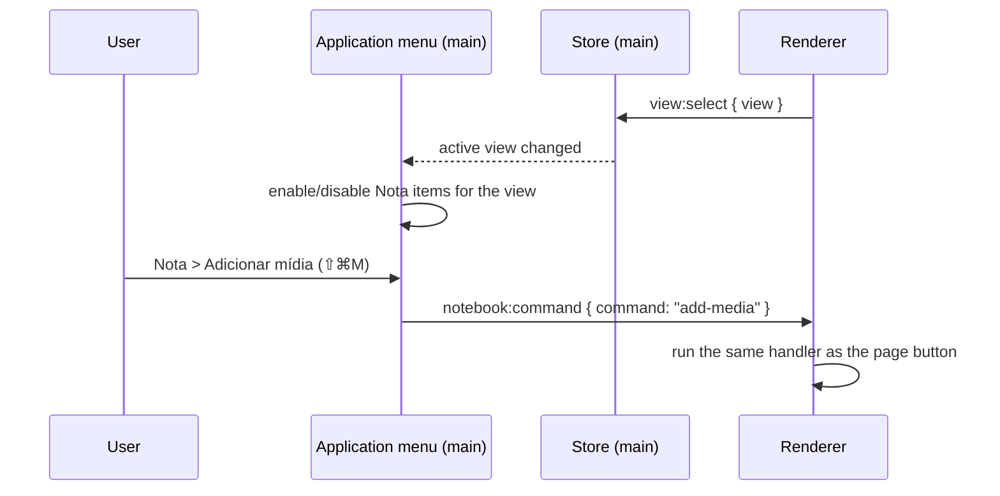

# Specification: Native Mac Paper Refresh

- **Specification ID**: 003
- **Date**: 2026-10-04
- **Slug**: native-mac-paper-refresh
- **Status**: Not Implemented
- **Owner**: Renderer presentation shell and main-process window chrome
- **Related Specification**: [001 — Project Structure](001-2026-10-04-project-structure.md)

---

## Context & Background

Caderninho is a macOS desktop app with a deliberate vintage stationery identity: cream paper, ink outlines, notebook tabs and an upward page flip. A design review of the current screens (Página do dia, notes, checklist, block palette, Lembretes calendar, Cadernos, diagram error state) found that the stationery is rendered as a costume rather than as a material. Decoration consumes space and hierarchy, and the window ignores macOS conventions.

This specification keeps the stationery identity and refines how it is expressed. The user approved four direction decisions on 2026-10-04:

1. Replace the top spiral rings with a discreet binding on the left edge of the book.
2. Use native macOS traffic lights and remove the drawn resize handles (bottom handle and corner grip). Resizing from the book border stays.
3. Use Apple's New York serif for writing and interface text. Chalkboard SE leaves the interface, and a handwritten face appears only in rare accents.
4. Turn the sidebar into a narrow Mac-style source list with small stroke icons. Illustrated icons are reserved for empty states and onboarding.

Unchanged: the notebook tabs on the right edge, the folded paper tab that collapses the sidebar, the page flip animation, the command palette behavior, the pastel notebook colors, the editor model and all persistence.

---

## Problem Statement

### 1. Chrome consumes the page

The spiral rings, an empty row that holds only the drawn traffic lights, the view toolbar, the title and the metadata push the first line of content to about 40% of the window height. The rings alone take about 65pt and carry no function.

### 2. The window does not behave like a Mac window

- The traffic lights are drawn inside the paper, offset downward, and use pastel colors. This breaks muscle memory and does not respond to the system window state (inactive window, hover glyphs, accessibility).
- The bottom handle and the corner grip are touch-style affordances that macOS users do not expect.
- Secondary actions exist only as page buttons and have no entries in the application menu and no keyboard shortcuts.

### 3. Three typographic voices compete

Georgia bold (display), Georgia (body) and Chalkboard SE (labels, sidebar, calendar month and day headings, notebook names) are mixed on the same screen. Chalkboard SE reads as childish and undermines trust in the product. In addition, `text-transform: capitalize` produces incorrect Portuguese casing ("Domingo, 4 De Outubro", "Outubro De 2026").

### 4. Three icon families

Large colored illustrations in the sidebar (52px), medium strokes in the view toolbar and hairline arrows in the pager do not read as one system. The sidebar icons draw more attention than the note title.

### 5. No surface hierarchy

The page, sidebar, popovers, command palette and toasts all use the same cream. The palette is separated from the page only by its border. Toasts use a heavy 2px ink border, a 6px yellow bar and an offset shadow, so they compete with the content.

### 6. The accent yellow is overloaded

`--accent-soft` marks hover, selection, the active sidebar item, the selected calendar day, checked checkboxes and the toast bar. On the calendar, "today" (ink circle) and "selected" (yellow cell) can't be told apart at a glance.

### 7. The view toolbar has no hierarchy

On the note view, "Relacionados" is regular weight, "Adicionar mídia" and "Nova nota" are bold, PDF export is icon-only and the trash icon is permanently red. Five actions compete with the same visual weight and none is primary.

### 8. Página do dia layout and copy defects

- The latest-note preview is squeezed into a narrow column, so text wraps word by word next to an image.
- The empty state of the related graph takes more space than the note.
- The summary line reads "1 lembretes" (wrong plural).
- The section caption "Seu caderno em conexão" does not say what the section is.

### 9. Readability

The muted text color `#8a8068` reaches 3.45:1 on paper (`#fbf0d5`) and 2.99:1 on paper shade (`#efe0b9`), below WCAG AA 4.5:1 for 12px metadata. Disabled "Remover" in pale red is nearly invisible.

---

## Solution

1. **Binding instead of rings.** Remove the spiral rings and the top band they need. The book gets a discreet stitched binding along its left edge, using paper-shade and ink tokens. The page content starts directly below the native traffic light row.
2. **Native window chrome.** The window uses a hidden title bar with native traffic lights, positioned over the top-left of the paper and repositioned when the sidebar collapses or expands. The drawn traffic lights, the bottom handle and the corner grip are removed. Book-border resizing (`.book-edges`) and top double-click to toggle height stay. The green button applies the same height toggle as the double-click.
3. **One serif family.** New York, loaded at runtime from the macOS system font files through a read-only font protocol, becomes the single typeface for writing, titles and interface labels. Hierarchy comes from size, weight and color, not from a second face. Chalkboard SE is removed from the interface. A handwritten accent face is used in exactly two places: the Página do dia date and the notebook tab label.
4. **One icon system.** Interface icons (sidebar, toolbar, pager, palette, controls) share one stroke style: 1.5px ink stroke on a 20px grid, rendered at 16–20px. Illustrated icons appear only in empty states.
5. **Source-list sidebar.** The sidebar is a narrow list with one row per destination (16px stroke icon plus label, 32px row height), on a darker kraft paper surface. The active row uses the selection fill. The folded paper tab that collapses it is kept.
6. **Surface layers.** Three paper layers: kraft (sidebar, behind), paper (page) and raised sheet (palette, popovers, dialogs, toasts), lighter than the page with a short soft shadow and a 1px hairline border instead of the 2–3px ink border.
7. **Accent discipline.** Yellow (`--accent-soft`) is used only for selection: the active sidebar row, the selected palette option, the selected calendar day, text selection. Hover uses a subtle darkening of the paper. "Today" on the calendar is an ink ring. Checked checkboxes use an ink check on paper.
8. **Toolbar with one primary action.** Each view shows one primary action (e.g. "Nova nota"). Secondary actions move into a single overflow button ("Mais") on the page and into the application menu with shortcuts. The trash action is only red on hover and inside its menu.
9. **Application menu.** The native menu gains a "Nota" menu with: Nova nota, Adicionar mídia, Relacionados, Exportar PDF and Mover para a lixeira. Items are enabled only on views where they apply.
10. **Página do dia.** The latest-note preview takes the full content width above the related graph. When the graph has no connections, it collapses to a single line instead of a large empty block. The summary pluralizes correctly and the section caption is rewritten.
11. **Readability tokens.** `--muted` becomes `#6b624c` (5.33:1 on paper, 4.61:1 on paper shade). Disabled destructive actions use muted ink at reduced opacity with a "not allowed" cursor instead of pale red.
12. **Toast.** A raised sheet with a hairline border, 14px text and no side bar, bottom-centered above the footer.



---

## Practical Gains & Operational Outcomes

1. **Content space**:
   - *Before*: the first content line starts at about 40% of the window height.
   - *Now*: the rings and the empty traffic-light row are gone, and content starts right below the native title area.
2. **Platform fit**:
   - *Before*: drawn traffic lights, touch-style grips, actions available only as page buttons.
   - *Now*: native traffic lights with system behavior, border resizing only, every page action reachable from the menu bar with a shortcut.
3. **Hierarchy and trust**:
   - *Before*: three typefaces, three icon families, one flat surface color, yellow everywhere.
   - *Now*: one serif family, one stroke icon system, three paper layers, yellow means "selected".
4. **Readability**:
   - *Before*: 12px metadata at 3.45:1, incorrect casing and plurals.
   - *Now*: AA contrast for all text tokens, correct Portuguese casing and plurals.

---

## User Stories

- [ ] 1. As a Mac user, I want the real traffic lights in their usual place, so that closing, minimizing and zooming work like every other window.
- [ ] 2. As a Mac user, I want the green button to toggle the notebook's full-height size, so that it behaves like the top double-click.
- [ ] 3. As a writer, I want the page to start near the top of the window, so that I see more of my note.
- [ ] 4. As a writer, I want the notebook to still feel like paper, so that the app keeps its identity without decorative clutter.
- [ ] 5. As a reader, I want one consistent typeface for text and labels, so that the interface feels calm and serious.
- [ ] 6. As a reader, I want dates written in correct Portuguese casing ("domingo, 4 de outubro"), so that the app does not look careless.
- [ ] 7. As a user, I want the sidebar to be a compact list, so that navigation takes less room than my content.
- [ ] 8. As a user, I want icons that share one style, so that I recognize controls without decoding three visual languages.
- [ ] 9. As a user, I want popovers, the command palette and notices to sit visibly above the page, so that I know what is temporary.
- [ ] 10. As a user, I want yellow to mean "selected", so that I always know where I am.
- [ ] 11. As a user, I want "today" and "selected day" to look different on the calendar, so that I don't confuse them.
- [ ] 12. As a user, I want one clear primary action per view, so that the toolbar doesn't make me read every button.
- [ ] 13. As a keyboard user, I want Nova nota, Adicionar mídia, Relacionados, Exportar PDF and Mover para a lixeira in the menu bar with shortcuts, so that I don't have to reach for the page toolbar.
- [ ] 14. As a user, I want menu items that do not apply to the current view to be disabled, so that I don't trigger actions that do nothing.
- [ ] 15. As a user, I want the trash action to look destructive only when I aim at it, so that the toolbar doesn't feel alarming.
- [ ] 16. As a user, I want the Página do dia note preview to use the full width, so that text doesn't wrap word by word.
- [ ] 17. As a user, I want an empty related graph to take one line, so that it doesn't dominate the page.
- [ ] 18. As a user, I want "1 lembrete" / "2 lembretes" pluralized correctly, so that the summary reads naturally.
- [ ] 19. As a user, I want metadata text readable at AA contrast, so that dates and counts aren't strained to read.
- [ ] 20. As a user, I want disabled destructive actions to be clearly disabled rather than faded pink, so that I understand why I can't use them.
- [ ] 21. As a user, I want notices that are visible but quiet, so that confirmations don't interrupt writing.
- [ ] 22. As a user, I want resizing from the book border to keep working, so that removing the grips doesn't remove the ability.
- [ ] 23. As a user, I want the traffic lights to follow the book when I collapse or expand the sidebar, so that they always sit on the paper.
- [ ] 24. As a user who prefers reduced motion, I want the refreshed hover and sidebar transitions to respect that setting, so that the interface stays still.

---

## Architecture Gate

### 1. Bounded Context & Ubiquitous Language
- **Context**: Presentation shell (renderer styles, shared controls, sidebar, toolbar, toasts, home layout) and Window chrome (main-process window options, application menu, font protocol). No domain, persistence or SQLite change.
- **Package Ownership**:
  - Main process: window creation options and traffic light positioning; application menu construction and enablement; read-only font protocol handler.
  - Preload: one purpose-specific listener for menu commands.
  - Renderer: style tokens, shared control styles, sidebar markup, icon set, view toolbars with overflow, toast, home layout, calendar day states, date and plural formatting.
  - Shared: pure date-casing and pluralization helpers if they are used by more than one renderer module.
- **Ubiquitous Terms**:
  - `Binding`: the stitched strip on the book's left edge that replaces the spiral rings.
  - `Kraft`, `Paper`, `Raised sheet`: the three surface layers, from back to front.
  - `Primary action`: the single emphasized action of a view toolbar.
  - `Overflow`: the "Mais" button that lists a view's secondary actions.
  - `Note command`: an action invocable both from the page and from the "Nota" menu.

### 2. Aggregate Root & State Transitions
- **Entities & State Machine**: none. Existing persisted state is read as is: `activeView` and `sidebarCollapsed`.
- **Invariants**:
  - Every note command reachable from the page is reachable from the "Nota" menu, and both paths run the same renderer handler.
  - A "Nota" menu item is enabled only when the active view supports it.
  - Native traffic lights always sit over the paper of the book, in both sidebar states.
  - The font protocol serves only the fixed system font identifiers it declares, and nothing else.

### 3. Commands, Queries & Domain Ports
```javascript
/** @typedef {'new-note'|'add-media'|'related'|'export-pdf'|'trash-page'} NoteCommand */
/** @typedef {{ onCommand(listener: (command: NoteCommand) => void): () => void }} NoteCommandPort */
```
- View-to-command availability is a pure table: notes view supports all five commands; checklist and reminder page views support `new-note`, `export-pdf` and `trash-page`; home, notebooks, tasks, reminders calendar and trash views support `new-note` only. If the current code shows a view supporting a different set of actions, implementation STOPS and asks.

### 4. IPC Contract & External Input Validation
- **Added** `notebook:command` (main → renderer, `webContents.send`), payload `{ command: NoteCommand }`. Exposed by preload as `onCommand(listener)` returning an unsubscribe function. The renderer ignores values outside the `NoteCommand` enum.
- **Changed** `notebook:window` (invoke): the `close` and `minimize` actions are removed. `maximize` (height toggle, used by top double-click) and `state` remain.
- **Added** protocol `caderno-font://` (privileged, standard, secure). Hosts map to fixed files: `new-york` → `/System/Library/Fonts/NewYork.ttf`, `new-york-italic` → `/System/Library/Fonts/NewYorkItalic.ttf`. Any other host or a non-empty path returns 404. Responses carry `Content-Type: font/ttf`. The renderer CSP adds `font-src 'self' caderno-font:`.
- Menu enablement reacts to `view:select` in the main process; no renderer input is trusted for it.

---

## Implementation Decisions

1. **Window**: `frame: false` becomes `titleBarStyle: 'hidden'` with `trafficLightPosition` over the paper. The position is updated with `setWindowButtonPosition` when `sidebarCollapsed` changes. `transparent: true` and the current drag, resize and height-toggle logic remain. The green button is wired to the existing height toggle.
2. **Removed elements**: spiral ring markup and styles, the drawn traffic light buttons and their styles, the bottom handle and the corner grip. `.book-edges` stays.
3. **Binding**: a CSS-only stitched strip (dashed hairline plus shade band) along the left edge of the sheet. No new image assets.
4. **Typography tokens**: `--body-font` becomes New York (declared through `@font-face` on `caderno-font://`, variable weight range) followed by the generic `serif` keyword only. `--hand-font` changes meaning to "accent only" and is applied to exactly two selectors: the Página do dia date and the notebook tab label. Every other current use of `--hand-font` or a literal `'Chalkboard SE'` moves to `--body-font`.
5. **Type scale**: one scale for the whole app, defined as tokens: 12px metadata, 13px controls and labels, 15px secondary text, 17px writing, 22px section heading, 28px page title. Weights 400/600/700 only.
6. **Casing**: remove `text-transform: capitalize` from dates and months. Formatted dates follow Portuguese casing: weekday and month in lower case, sentence-initial capital only where the date starts a line.
7. **Pluralization**: one helper `plural(count, singular, plural)` used by the Página do dia summary and every count label that can be 1.
8. **Icons**: one stroke icon set (1.5px ink stroke, round caps and joins, 20px grid) replaces the sidebar illustrations, toolbar icons and pager arrows. Existing illustrations are kept only in empty states.
9. **Sidebar**: vertical list, 32px rows, 16px icons, label in 13px New York, kraft surface token `--kraft`, active row in `--accent-soft`, hover in `--hover`. Width shrinks to fit the longest label plus padding.
10. **Surface tokens**: add `--kraft`, `--sheet-raised`, `--hover`, `--hairline`. The command palette, popovers, dialogs and toasts use `--sheet-raised`, a 1px `--hairline` border and a short soft shadow.
11. **Accent usage**: `--accent-soft` is used only for selection states listed in the Solution. A CSS audit removes it from hover rules, checked checkboxes and toast decoration.
12. **Calendar**: today = 1.5px ink ring around the day number; selected = `--accent-soft` fill; both can coexist.
13. **Toolbars**: each view declares its primary action and its overflow list. Overflow opens a raised-sheet menu with the same rows and icons as the "Nota" menu.
14. **Menu shortcuts**: Nova nota ⌘N (already handled in the renderer, moves to the menu accelerator), Adicionar mídia ⇧⌘M, Relacionados ⌥⌘R, Exportar PDF ⇧⌘E, Mover para a lixeira ⌘⌫. Existing ⌘F search is unchanged.
15. **Página do dia**: the latest-note preview spans the full content width; media in the preview flows below text, never beside it. The related section with zero connections renders as one muted line. The caption "Seu caderno em conexão" is replaced with "Notas parecidas com a última que você escreveu".
16. **Tokens**: `--muted: #6b624c`. Disabled destructive controls: `--muted` at 55% opacity, `cursor: not-allowed`.
17. **File responsibility**: font protocol and menu construction each live in their own main-process module, not inline in the window bootstrap. Each changed file keeps one primary responsibility.
18. **Inward dependencies**: renderer formatting helpers do not import Electron APIs; main menu enablement reads the store, never renderer state.

---

## Testing Decisions

A good test checks external behavior: what the user sees in a running app or what an IPC/protocol boundary returns, not CSS internals.

### Unit Tests
- `plural(1, 'lembrete', 'lembretes')` → "1 lembrete"; `plural(0, …)` and `plural(2, …)` → plural form.
- Date formatting yields "domingo, 4 de outubro" and "outubro de 2026" (no capitalized connectors).
- The view-to-command availability table returns the expected command set for every view.

### Integration & Contract Tests
- Font protocol: `new-york` and `new-york-italic` return 200 with `font/ttf`; unknown host, path traversal (`new-york/../..`) and non-empty paths return 404.
- Menu: after `view:select` to each view, "Nota" items are enabled exactly per the availability table.
- `notebook:window` rejects `close` and `minimize`.

### UI Smoke Tests (Electron, sequential)
- Each "Nota" menu item, when clicked, triggers the same observable outcome as its page button (new note created, media dialog requested through the sandboxed swap, related panel opened, PDF export requested through the sandboxed dialog, page moved to trash).
- The overflow button lists the view's secondary actions and runs them.
- A rendered element using `--body-font` resolves to New York (measured text width differs from the generic serif fallback).
- The Página do dia summary shows "1 lembrete" with one reminder.
- Book-border resizing still changes window bounds after the grips are removed.

### Regression Tests
- Existing unit and smoke suites pass unchanged except for selectors of removed elements, which are deleted with their elements.
- The production-boundary test still passes (no test hooks in `src/`).

### Visual Validation
Per project rules, screen appearance is validated by the user in the running app, not by automated DOM or screenshot inspection. Implementation ends by asking the user to check: binding, traffic light position in both sidebar states, typography, sidebar, palette layering, calendar today/selected, toolbar overflow, Página do dia, toasts.

---

## Acceptance Criteria

- [ ] 1. No spiral rings are rendered; a left-edge binding is visible on the book.
- [ ] 2. Native traffic lights are shown over the paper in both sidebar states; drawn traffic lights, bottom handle and corner grip are gone.
- [ ] 3. The green button and top double-click toggle the same full-height size; border resizing still works.
- [ ] 4. New York is the rendered typeface for writing, titles and labels; the handwritten accent appears only on the Página do dia date and the notebook tab label.
- [ ] 5. Dates and months follow Portuguese casing; all count labels pluralize correctly.
- [ ] 6. All interface icons use the single stroke style; illustrations remain only in empty states.
- [ ] 7. The sidebar is a source list on the kraft surface with 32px rows.
- [ ] 8. Palette, popovers, dialogs and toasts use the raised sheet with hairline border.
- [ ] 9. Yellow appears only on selection states; calendar today and selected day are distinct.
- [ ] 10. Each view shows one primary action and an overflow; trash is red only on hover.
- [ ] 11. The "Nota" menu exposes the five note commands with the listed shortcuts and correct enablement.
- [ ] 12. Página do dia shows a full-width note preview and a one-line empty related state with the new caption.
- [ ] 13. `--muted` text meets 4.5:1 on paper and paper shade.
- [ ] 14. Reduced-motion users see no hover wobble or sidebar transition.
- [ ] 15. `docs/DESIGN.md` and `docs/PRODUCT.md` are updated to describe the new tokens, typography, icon system and surfaces.
- [ ] 16. All unit, integration, smoke and regression tests pass.
- [ ] 17. Quality checks (`npm test` on Node 22+, `node --check` on changed files, affected smoke tests) pass with 0 errors.
- [ ] 18. The packaged app starts and loads New York from the system font files.

---

## Out of Scope

- Dark mode ("noite") redesign. Tokens are added in a way that a later spec can extend.
- Full-screen support (`fullscreenable` stays `false`).
- Changes to the right-edge notebook tabs and the folded sidebar tab (readability of vertical tab text is a candidate for a later spec).
- Editor behavior, command palette behavior, slash commands, block types, diagrams rendering.
- Page flip animation.
- Bundling any Apple font file inside the app package.
- New illustrations for empty states.

---

## Open Questions

1. **Handwritten accent face**: this spec proposes Excalifont (already bundled for diagrams, SIL OFL), so diagrams and accents share one hand. Alternative: keep Chalkboard SE for those two accents. Must be confirmed before implementation.
2. **Green button feasibility**: Electron has no event before a native zoom. If wiring the green button to the custom height toggle cannot be done without a visible maximize-then-resize flicker, implementation STOPS and asks the user to choose between native zoom and disabling the green button.

---

## Further Notes

- New York is read at runtime from the user's macOS installation, never redistributed. Electron 44's Chromium does not resolve New York through `ui-serif`, `"New York"` or `".New York"` (verified on 2026-10-04: all three measure identically to Times), which is why the font protocol is required.
- `NewYork.ttf` is expected to be a variable font. If it is not, `@font-face` declarations are split per weight, and implementation records the deviation here.
- This specification supersedes the parts of earlier user directives that required drawn traffic lights, visible right/bottom/corner grips, Chalkboard SE labels and illustrated sidebar icons. `docs/PRODUCT.md` "Personality and references" must be rewritten to "warm vintage stationery expressed as material: paper layers, ink, binding and pastel notebook tabs".
