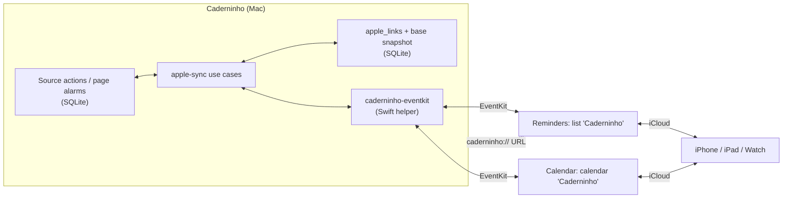
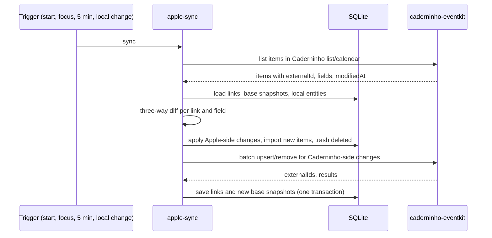
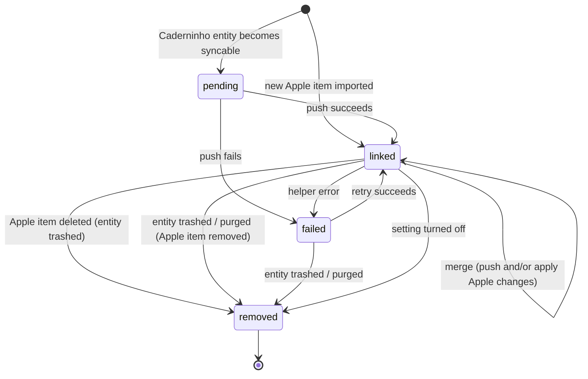

# Specification: Apple Reminders and Calendar Integration

- **Specification ID**: 004
- **Date**: 2026-10-04
- **Slug**: apple-reminders-calendar
- **Status**: Not Implemented
- **Owner**: `apple-sync` bounded context (main process) and the native EventKit helper
- **Related Specification**: [003 — Native Mac Paper Refresh](003-2026-10-04-native-mac-paper-refresh.md)

---

## Context & Background

Caderninho creates two kinds of time-bound items:

- **Source actions** (`source_actions`): tasks and reminders created from a selected passage, image or link card, each keeping its origin (quote and block range, or media cut).
- **Page alarms**: one absolute alarm per page (`notes.scheduled_at` with `reminder_enabled`), set from the **Agendar** stamp or the reminder page.

Alerts are fired by the main process: a one-second interval (`checkReminders`) reads due items from SQLite, plays `alarm.wav` through `afplay`, shows an Electron `Notification` and sends `notebook:reminder` to the renderer. All of this exists only while the app runs.

The product review on 2026-10-04 identified two adoption blockers that sit on top of the app's main differentiator (actions anchored to their origin):

1. A reminder that does not fire when the app is closed breaks trust in the reminder feature.
2. There is no way to see, change, complete or capture tasks away from the Mac.

Building our own sync service and mobile app contradicts the local-first, no-account principle. macOS already ships Reminders and Calendar, which sync to iPhone, iPad and Apple Watch through the user's own iCloud account and deliver alerts while Caderninho is closed. This specification synchronizes Caderninho's actions with those apps in both directions through EventKit, keeping Caderninho as the place where the context lives.

Nothing in the editor, the margin layout, related pages or PDF export changes, apart from the sync status described below.

---

## Problem Statement

### 1. Alerts depend on the app process

`checkReminders` runs inside the Electron main process. When the app is quit or the Mac sleeps, nothing fires; a missed alert plays only when the app comes back.

### 2. Actions are confined to the Mac

Tasks and reminders exist only in the local SQLite database. They cannot be seen, completed, rescheduled or created on the phone, so the app becomes a place to "organize later" instead of the place where actions live.

### 3. Exported actions would lose their origin

If a user copies a task into Apple Reminders by hand, it loses the passage and the note it came from: exactly the problem Caderninho exists to solve. Any integration must carry the origin with it, and anything captured on the phone needs a page in Caderninho where context can be added later.

### 4. Two writers need a conflict rule

Once the same item can be edited in Caderninho and in Reminders or Calendar, sync must know which side changed each field since the last sync, and resolve edits to the same field on both sides deterministically, without silent data loss.

---

## Solution

1. Add an opt-in **Lembretes e Calendário** setting, off by default. Turning it on requests macOS access and synchronizes pending actions.
2. Synchronize in both directions:
   - **Caderninho → Apple**: create, update, complete, remove.
   - **Apple → Caderninho**: title, due date, completion and deletion of synced items; and **new items** created in the **Caderninho** list or calendar.
3. Use dedicated containers: a **Caderninho** list in Reminders and, for timed items when chosen, a **Caderninho** calendar in Calendar, both created in the account Reminders/Calendar uses for new items, so iCloud carries them to other devices. Sync never reads or writes anything outside these containers.
4. Each synced item carries the origin: the note title and quoted passage in its notes field, and a `caderninho://action/<id>` (or `caderninho://page/<id>`) URL that opens the note and highlights the passage on the Mac.
5. A new item captured in Reminders or Calendar becomes a **new note** in the chosen inbox notebook, titled with the item title, with the task or reminder anchored to the note's first line. The user can add context to that note later, and the action keeps its anchor like any other.
6. Resolve conflicts per field with a three-way comparison against the last synchronized snapshot (base): a field changed on one side wins; a field changed on both sides is resolved by the later modification time, Caderninho winning ties.
7. Deletion on either side moves the counterpart away: an Apple deletion moves the Caderninho action to the trash (recoverable); a Caderninho trash or purge removes the Apple item. Restoring from the trash creates a new Apple item.
8. Talk to EventKit through a new, single-purpose Swift helper (`caderninho-eventkit`), invoked with `execFile`, JSON over stdin/stdout, timeouts and bounded output, following the existing OCR helper pattern.
9. When an alarm is synced, Apple delivers the alert. Caderninho stops playing its own sound and notification for that item to avoid duplicate alerts, but still marks it fired at its due time so the daily page and history stay correct.



### Sync pass



---

## Practical Gains & Operational Outcomes

1. **Reliable alerts**:
   - *Before*: alerts fire only while Caderninho runs; closed app or sleeping Mac means a missed alert.
   - *Now*: synced alarms are delivered by Reminders or Calendar on every device signed in to the user's iCloud, whether Caderninho is open or not.

2. **Actions away from the Mac**:
   - *Before*: tasks are visible and editable only in the Mac app.
   - *Now*: tasks can be completed, renamed, rescheduled or deleted on the phone, and Caderninho reflects it on the next sync, including the green highlight on the original passage.

3. **Capture on the phone, context on the Mac**:
   - *Before*: an idea on the go goes to another app and never comes back.
   - *Now*: a reminder added to the **Caderninho** list on the phone becomes a note in Caderninho with the task anchored to it, ready for context.

4. **Context travels with the action**:
   - *Before*: copying a task to another app drops its origin.
   - *Now*: every synced item shows the note title and quoted passage, and on the Mac its link opens the note at the highlighted passage.

5. **No account, no server**:
   - *Before / Now*: Caderninho still sends nothing to any server of its own. Syncing between devices is done by Apple's apps under the user's existing account, only after the user turns the setting on.

---

## User Stories

- [ ] 1. As a user, I want to turn on **Lembretes e Calendário** from the app menu, so that my actions also live in Apple's apps.
- [ ] 2. As a user, I want the setting off by default, so that nothing leaves the Caderninho database unless I choose it.
- [ ] 3. As a user, I want macOS to ask me for Reminders (and Calendar, when chosen) access only when I turn the setting on, so that permission prompts make sense in context.
- [ ] 4. As a user who denied access, I want a clear message and a button that opens the matching Privacy pane in System Settings, so that I can fix it without searching.
- [ ] 5. As a user, I want every pending source task to appear in a **Caderninho** list in Reminders, so that I can see my tasks on the phone.
- [ ] 6. As a user, I want every future source reminder and page alarm to appear with its date, time and alert, so that I am alerted even when the Mac app is closed.
- [ ] 7. As a user, I want to choose whether timed items go to **Lembretes** (default) or **Calendário**, so that they appear where I plan my day.
- [ ] 8. As a user, I want each synced item to show the note title and the quoted passage, so that I know why it exists when I read it on the phone.
- [ ] 9. As a user on the Mac, I want to click the link in a synced item and land on the note with the passage highlighted, so that **Ver origem** works from Apple's apps too.
- [ ] 10. As a user, I want completing or reopening a task in either app to update the other, so that I never check it twice.
- [ ] 11. As a user, I want renaming an action in either app to update the other, so that the title is the same everywhere.
- [ ] 12. As a user, I want rescheduling a reminder in either app (or moving its event in Calendar) to update the other, so that the alert time is the same everywhere.
- [ ] 13. As a user, I want deleting an item in Reminders or Calendar to move the Caderninho action to the trash, so that my deletion is respected and still recoverable.
- [ ] 14. As a user, I want moving an action or its note to the trash in Caderninho to remove the synced item, and restoring to bring it back, so that the trash works as I expect.
- [ ] 15. As a user, I want a reminder I add to the **Caderninho** list on my phone to become a note in Caderninho with the task anchored to its first line, so that I can capture on the go and add context later.
- [ ] 16. As a user, I want a timed reminder or an event I add to the **Caderninho** list or calendar to become a note with a reminder at that time, so that it keeps alerting and shows on the daily page.
- [ ] 17. As a user, I want to choose the notebook that receives items created on the phone, so that captures land where I review them.
- [ ] 18. As a user, I want edits made on both sides to the same field between two syncs to resolve to the most recent one, so that the result is predictable.
- [ ] 19. As a user, I want completing a timed reminder in Reminders to count as handled in Caderninho, so that it does not alert again on the Mac.
- [ ] 20. As a user, I want only one alert per item, so that I am not alerted twice by Caderninho and by Apple.
- [ ] 21. As a user, I want the daily page and its history to keep showing fired reminders at their time, so that turning on the integration does not change my record.
- [ ] 22. As a user, I want a small mark on each synced action in the margin (**No Lembretes** / **No Calendário**), so that I know what is on my phone.
- [ ] 23. As a user, I want turning the setting off to stop syncing and offer to remove the items Caderninho created, so that I can leave cleanly.
- [ ] 24. As a user, I want sync failures shown as a readable notice in the setting, not as silent failures, so that I trust what I see.
- [ ] 25. As a user, I want Caderninho's own alerts to keep working for items that could not be synced, so that a sync failure never makes me miss an alert.

---

## Architecture Gate

### 1. Bounded Context & Ubiquitous Language
- **Context**: `apple-sync`.
- **Package Ownership**:
  - `src/main/apple-sync/domain/`: link entity, synced item and snapshot value objects, three-way merge rules, state transitions and invariants, ports (`AppleBridgePort`, `AppleLinkRepositoryPort`, `SyncSourcePort`, `ClockPort`). Owner: `apple-sync` context.
  - `src/main/apple-sync/application/`: one use case per file: `configure-apple-sync`, `get-apple-sync-status`, `run-sync-pass`, `merge-linked-item`, `import-apple-item`, `remove-synced-item`.
  - `src/main/apple-sync/infrastructure/`: SQLite `apple_links` repository, helper adapter (`execFile` of `caderninho-eventkit`), sync source adapter reading and writing `source_actions`, page alarms and imported notes through store commands, settings adapter.
  - `src/main/apple-sync/presentation/`: IPC handlers and the `caderninho://` URL handler.
  - `src/renderer/apple-sync-ui.js`: settings dialog and margin mark rendering (no business rules).
  - `native/eventkit.swift` → build output `native/caderninho-eventkit`, built by `scripts/build-eventkit.cjs`. Owner: `apple-sync` infrastructure.
- **Ubiquitous Terms**:
  - `Synced item`: the Apple representation (Reminders item or Calendar event) of one Caderninho source action or page alarm.
  - `Link`: the persisted association between a Caderninho entity and its synced item, with the base snapshot.
  - `Base snapshot`: the field values (`title`, `due`, `done`) both sides agreed on at the end of the last successful sync of a link.
  - `Target`: where a synced item lives: `reminders` or `calendar`.
  - `Timed target`: the user's choice of target for items with a due time (`reminders` default, or `calendar`). Untimed tasks always target `reminders`.
  - `Inbox notebook`: the notebook that receives notes created from items captured in Apple's apps.
  - `Import`: turning a new Apple item (no link) in a Caderninho container into a Caderninho note plus an anchored action.

### 2. Aggregate Root & State Transitions
- **Aggregate root**: `Link`, keyed by `(entityKind, entityId)` where `entityKind ∈ {source-action, page-alarm}`, unique on `externalId`.
- **States**: `pending` (no external item yet), `linked`, `failed`, `removed` (terminal, row deleted).



- **Syncable entities**:
  - Source task: not deleted, note not trashed (done tasks stay synced as completed).
  - Source reminder: not deleted, note not trashed, not cancelled, due in the future at the time it is first pushed.
  - Page alarm: page not trashed, `reminder_enabled`, `scheduled_at` in the future at the time it is first pushed.
- **Three-way merge** (per field `title`, `due`, `done`; `local` = Caderninho now, `remote` = Apple now, `base` = snapshot):
  - `local = base`, `remote ≠ base` → apply remote to Caderninho.
  - `local ≠ base`, `remote = base` → push local to Apple.
  - both changed and equal → nothing to do.
  - both changed and different → the side with the later modification time wins (Caderninho `updated_at` vs Apple `lastModifiedDate`); ties go to Caderninho.
  - After the merge, the base snapshot is set to the agreed values in the same transaction that applies local changes.
- **Field ownership**:
  - `title`: both directions.
  - `due`: both directions for source reminders and page alarms; ignored for source tasks (a due date added on the phone stays in Apple and is never cleared by Caderninho).
  - `done`: both directions for source tasks. For timed items, Apple completion marks the Caderninho reminder as fired (alert handled) if it has not fired yet; Caderninho never sets completion on timed items.
  - Notes field and URL: Caderninho → Apple only; edits made to them in Apple are overwritten on the next push.
- **Invariants**:
  - At most one link per entity and one link per external identifier.
  - Caderninho never reads or writes outside its own **Caderninho** list and calendar. An item moved by the user to another list or calendar is treated as deleted.
  - Apple deletion moves the Caderninho action (or page alarm) to the trash, never purges it. A page alarm deleted in Apple is unscheduled, not trashed with its page.
  - An imported item always produces a note with the action anchored to an existing text range of that note.
  - A remote change that fails Caderninho validation (empty or over-limit title, unparsable date) is not applied; the link records the error and the local value is pushed back.
  - Caderninho suppresses its own sound and notification for an item only while its link is `linked`. `pending` and `failed` items alert through Caderninho as today.
  - Every due reminder is still marked `fired_at` at its time (or on next launch), whether or not it is linked.
  - One sync pass runs at a time; triggers arriving during a pass schedule exactly one follow-up pass.

### 3. Commands, Queries & Domain Ports
```javascript
/** @typedef {'source-action'|'page-alarm'} EntityKind */
/** @typedef {'reminders'|'calendar'} Target */
/** @typedef {{ title: string, due: string|null, done: boolean }} Snapshot */
/** @typedef {{ entityKind: EntityKind, entityId: string, kind: 'task'|'timed', fields: Snapshot, notes: string, url: string, updatedAt: string }} LocalItem */
/** @typedef {{ externalId: string, target: Target, fields: Snapshot, notes: string, modifiedAt: string }} RemoteItem */
/** @typedef {{ entityKind: EntityKind, entityId: string, target: Target, externalId: string|null, state: 'pending'|'linked'|'failed', base: Snapshot|null, lastSyncedAt: string|null, error: string|null }} Link */

/** @typedef {{
 *   authorize(targets: Target[]): Promise<{ reminders: 'granted'|'denied'|'notDetermined', calendar: 'granted'|'denied'|'notDetermined' }>,
 *   list(targets: Target[]): Promise<RemoteItem[]>,
 *   apply(operations: ({ op: 'upsert', target: Target, externalId: string|null, item: LocalItem } | { op: 'remove', target: Target, externalId: string })[]): Promise<({ ok: true, externalId: string } | { ok: false, error: string })[]>
 * }} AppleBridgePort */

/** @typedef {{ get(kind: EntityKind, id: string): Link|null, byExternalId(id: string): Link|null, save(link: Link): void, delete(kind: EntityKind, id: string): void, all(): Link[] }} AppleLinkRepositoryPort */

/** @typedef {{
 *   syncable(): LocalItem[],
 *   item(kind: EntityKind, id: string): LocalItem|null,
 *   applyRemote(kind: EntityKind, id: string, changes: Partial<Snapshot>): void,
 *   trash(kind: EntityKind, id: string): void,
 *   importItem(remote: RemoteItem, notebookId: string): { entityKind: EntityKind, entityId: string }
 * }} SyncSourcePort */
```

- **Commands**: `configureAppleSync({ enabled, timedTarget, inboxNotebookId, removeExisting? })`, `syncAppleNow()`.
- **Internal triggers** (not IPC): after every successful `source:*`, page schedule/unschedule, page trash/restore/purge command, the store emits a `sync-changed` domain event with `(entityKind, entityId)`; `apple-sync` debounces it (500 ms) and runs a pass. Passes also run on app start, on window focus and every 5 minutes while the setting is on.
- **Applying remote changes** goes through the same store commands the renderer uses (`source:update`, `source:toggle`, `source:remove`, page schedule commands, `note:create`), so validation, temporal events and the daily history stay identical. Remote-origin writes are tagged so they do not emit a new `sync-changed` event for the same pass.
- **Queries**: `getAppleSyncStatus()` → `{ enabled, timedTarget, inboxNotebookId, access: { reminders, calendar }, lastSyncAt, running, error, links: { [entityKey]: { target, state } } }`.

### 4. IPC Contract & External Input Validation

| Channel | Preload function | Payload | Result | Errors |
| :--- | :--- | :--- | :--- | :--- |
| `apple:status` | `appleSyncStatus()` | none | status object above | none (failures are part of the status) |
| `apple:configure` | `configureAppleSync(input)` | `{ enabled: boolean, timedTarget: 'reminders'\|'calendar', inboxNotebookId: uuid, removeExisting?: boolean }` | status object | invalid payload; unknown notebook; access denied (returned as status with `access`, not thrown) |
| `apple:sync-now` | `syncAppleNow()` | none | status object | helper missing or timed out → readable message |
| `apple:open-privacy` | `openApplePrivacy(target)` | `'reminders'\|'calendar'` | `void` | invalid target |
| `notebook:apple-status` (main → renderer) | `onAppleSyncStatus(callback)` | status object | none | none |

Imported notes and remote changes reach the renderer through the existing snapshot refresh (`notebook:navigate`/`notebook:day-updated` pattern); no new renderer write channel is added.

- Main-process validation: `enabled` strictly boolean; `timedTarget` from the enum; `inboxNotebookId` an existing notebook; unknown keys rejected.
- `apple:open-privacy` opens a fixed, hard-coded `x-apple.systempreferences:` URL per target; no renderer-provided URL is accepted. This is an approved exception to the `http:`/`https:` rule for `shell.openExternal`.
- `caderninho://` URLs (from `open-url`) are external input: accept only `caderninho://action/<uuid>` and `caderninho://page/<uuid>`, ignore anything else, and resolve only entities that exist and are not trashed. The single-instance lock forwards them to the running window.
- Helper output is external input: parse JSON with a size limit, validate shapes, identifiers, ISO dates and string lengths before they reach the domain. Remote titles are trimmed and limited to 500 characters (the source action limit); notes of imported items are limited to 20,000 characters; anything over the limit is rejected for that item and recorded as a link error.

---

## Implementation Decisions

1. **Scope of synced entities**: source tasks, source reminders and page alarms, plus items created in the **Caderninho** containers. Items of **Tarefas** checklist pages are not synced in this specification.
2. **Mapping Caderninho → Apple**:
   - Source task → Reminders item without a due date; `completed` mirrors `done`.
   - Source reminder / page alarm with timed target `reminders` → Reminders item with due date components and one absolute alarm at the due time.
   - With timed target `calendar` → Calendar event starting at the due time, 15 minutes long, with one alarm at the start.
   - Title: action title (or page title for page alarms). Notes field: `"<note title>\n\n“<quote>”"`, quote trimmed to 1,000 characters. URL field: `caderninho://action/<id>` or `caderninho://page/<id>`.
3. **Mapping Apple → Caderninho (import)**:
   - A Reminders item or Calendar event in a Caderninho container without a link is imported once.
   - A note is created in the inbox notebook with the item title as page title, and a body whose first line is the item title followed by the item's notes (if any).
   - A source action is created with its origin on the first line's text range: `task` for a Reminders item without a time, `reminder` for a Reminders item with a due time or for a Calendar event (due = start).
   - A timed item whose time already passed is imported as a reminder marked fired at import time, so it never alerts on the Mac.
   - A completed Reminders item is imported only if it was completed after the setting was turned on; earlier completed items are ignored.
   - After import, the item is updated with Caderninho's notes and URL format on the next push.
4. **Conflict timestamps**: Caderninho uses the entity's `updated_at`; Apple uses `lastModifiedDate`. Clock differences between devices are accepted as a known limitation; ties go to Caderninho.
5. **Containers**: the helper finds or creates a list named **Caderninho** in the source of `defaultCalendarForNewReminders()`, and a calendar named **Caderninho** in the source of `defaultCalendarForNewEvents`. Their identifiers are stored in settings and reused; if one is deleted by the user, it is recreated and all links of that target return to `pending`.
6. **Changing the timed target** removes timed items from the old target and pushes them to the new one; links keep their base snapshot.
7. **Helper protocol**: `caderninho-eventkit <command>` with commands `authorize`, `list`, `apply`; request JSON on stdin, response JSON on stdout. `execFile` with a 15-second timeout and 4 MB `maxBuffer`; non-zero exit maps to a readable error. `list` returns all items of the requested containers (completed reminders limited to the last 30 days); `apply` takes a batch, so one pass spawns at most two processes.
8. **Permissions and packaging**: macOS 14+ full-access APIs (`requestFullAccessToReminders`, `requestFullAccessToEvents`). The packaged app's `Info.plist` declares `NSRemindersFullAccessUsageDescription` and `NSCalendarsFullAccessUsageDescription` (via the packager's `extendInfo`), registers the `caderninho` URL scheme, and ships `caderninho-eventkit` as an extra resource. Permission attribution to the app (helper spawned as a child of Caderninho) must be verified in the packaged app.
9. **Schema**: new table `apple_links(entity_kind TEXT NOT NULL CHECK(entity_kind IN ('source-action','page-alarm')), entity_id TEXT NOT NULL, target TEXT NOT NULL CHECK(target IN ('reminders','calendar')), external_id TEXT UNIQUE, state TEXT NOT NULL CHECK(state IN ('pending','linked','failed')), base_title TEXT, base_due TEXT, base_done INTEGER, last_synced_at TEXT, error TEXT, PRIMARY KEY(entity_kind, entity_id))`. Settings keys: `apple_sync_enabled`, `apple_sync_enabled_at`, `apple_timed_target`, `apple_inbox_notebook_id`, `apple_reminders_list_id`, `apple_calendar_id`, `apple_last_sync_at`. Explicit migration, no compatibility path. Removing the inbox notebook moves the setting to the notebook that receives its pages.
10. **Alert suppression**: `checkReminders` asks the `apple-sync` context whether each due item is `linked`; linked items are marked fired and sent to the renderer for the daily page refresh, without `afplay` or `Notification`.
11. **Settings UI**: the app menu **Caderninho** gets **Lembretes e Calendário…**, opening a paper dialog (DESIGN.md modal style) with the on/off switch, the timed target choice, the inbox notebook, access state, last sync time, **Sincronizar agora** and any error. Turning off asks whether to remove the items Caderninho created.
12. **Margin mark**: synced actions show **No Lembretes** or **No Calendário** in the card status line; failed ones show **Não sincronizado** with the error in the dialog. Imported notes show **Criada no Lembretes** (or **no Calendário**) next to the page dates.
13. **Store integration**: the store emits `sync-changed` events from existing commands without depending on `apple-sync`; `apple-sync` reaches the store only through `SyncSourcePort`. No `apple-sync` import in `store.cjs` or `source-actions.cjs`.
14. **File limits**: each new file has one responsibility and targets ≤ 250 lines; `main.cjs` only wires the context.
15. **Dependency rule**: `domain/` imports nothing outside itself; Electron, `child_process` and SQLite appear only in `infrastructure/` and `presentation/`.

---

## Testing Decisions

Tests assert external behavior through the use cases with fake ports, and the IPC contract through the handlers. Prior art: `tests/*.test.cjs` with a temporary data directory, smoke scenarios in `tests/*-smoke.js` with effects swapped in `tests/smoke/sandbox.cjs`. The fake `AppleBridgePort` is an in-memory store of remote items that tests can edit, delete and add to between passes.

### Unit & Profile Tests
- Link state machine: every transition in the diagram, and rejected transitions (e.g. `removed` → anything).
- Three-way merge table: each combination of unchanged/changed on each side for `title`, `due` and `done`, including both-changed-equal, both-changed-different with remote later, local later, and tie.
- Field ownership: due added to a task remotely is ignored and never cleared; Apple completion of a timed item marks it fired; notes/URL edits remotely are overwritten.
- Mapping Caderninho → Apple: task, timed reminder to Reminders, timed reminder to Calendar, page alarm; notes text format and quote truncation; URL format.
- Mapping Apple → Caderninho: untimed item → note + task; timed item → note + reminder; past timed item → fired reminder; event → reminder at start; completed before enablement → ignored.
- Syncable rules: deleted action, trashed note, cancelled reminder and past-due reminder are not pushed.
- Remote validation: empty title, title over 500 characters and invalid date are rejected, recorded and overwritten by a push.

### Integration & Contract Tests
- `apple_links` migration on an existing database; repository CRUD and `external_id` uniqueness.
- `sync-changed` events emitted by `source:create`, `source:update`, `source:toggle`, `source:remove`, `source:restore`, `source:purge`, page schedule/unschedule, page trash/restore/purge; remote-origin writes do not re-emit.
- Full pass against a temporary database and the fake bridge: rename, reschedule, complete and delete on the remote side are applied through store commands and appear in temporal events; import creates the note in the inbox notebook with the action anchored to its first line.
- Apple deletion trashes the action; restoring it from the trash creates a new remote item and a new link.
- Concurrency: triggers during a running pass produce exactly one follow-up pass.
- Helper adapter with a fake executable: request shape, timeout, oversized output, non-zero exit, malformed JSON.
- IPC handlers: payload validation for every channel (wrong types, unknown keys, invalid enum, unknown notebook).
- `caderninho://` parser: accepts the two valid forms, rejects others, ignores trashed entities.

### Error Safety & UI Tests
- Denied access returns status with `access: 'denied'` and readable copy; no raw EventKit error text reaches the renderer.
- Smoke: open the dialog from the menu, enable with a fake bridge, see margin marks; a remote rename and completion appear in the open note; a remote new item appears as a note in the inbox notebook; disabling with removal.
- Smoke: a linked due reminder fires without sound or notification (swapped effects record no call) and still appears as fired on the daily page; an unlinked one plays as today.

### Regression Tests
- With the setting off (default), `checkReminders`, source actions, page alarms, daily page and trash behave exactly as before; no helper process is spawned.
- Existing source-action, reminder and daily-page smoke scenarios pass unmodified.

---

## Acceptance Criteria

- [ ] 1. The setting is off by default and no EventKit access is requested until the user turns it on.
- [ ] 2. With access granted, pending source tasks, future source reminders and future page alarms appear in the **Caderninho** list (or calendar for timed items when chosen) within one sync pass.
- [ ] 3. Synced items carry the note title, quoted passage and a `caderninho://` link that opens the note with the passage highlighted.
- [ ] 4. Title, due date, completion, trash, restore and purge changes in Caderninho are reflected in the synced item.
- [ ] 5. Title, due date, completion and deletion changes in Reminders or Calendar are reflected in Caderninho on the next pass; deletion moves the action to the trash.
- [ ] 6. A new item added to the **Caderninho** list or calendar becomes a note in the inbox notebook with the action anchored to its first line.
- [ ] 7. Conflicting edits to the same field resolve to the later modification, Caderninho winning ties, as defined by the merge table.
- [ ] 8. A linked reminder alerts once (through Apple); unlinked reminders alert through Caderninho as before; the daily page records both as fired.
- [ ] 9. Denied access, invalid remote data and helper failures are shown as readable messages, and Caderninho alerts still fire for unsynced items.
- [ ] 10. Turning the setting off stops all syncing; choosing removal deletes only items Caderninho created or imported.
- [ ] 11. Verified in the packaged app: permission prompts name Caderninho, the URL scheme opens the app, alerts arrive on the Mac with Caderninho closed, and an item added on an iPhone appears as a note after sync.
- [ ] 12. All unit, integration, and regression tests pass.
- [ ] 13. Quality checks (`npm test` on Node 22+, `node --check` on changed files, `node scripts/build-eventkit.cjs`, `npm run package`) pass with 0 errors.

---

## Out of Scope

- Reading or writing any Reminders list or Calendar calendar other than the dedicated **Caderninho** ones, including importing existing Apple reminders or events from other lists.
- Syncing the notes field or URL back from Apple to Caderninho.
- Syncing items of **Tarefas** checklist pages.
- Real-time sync through `EKEventStoreChanged` notifications; changes are picked up on the triggers listed above.
- Recurring reminders or events (an imported recurring item is imported as its next occurrence only; recurrence rules are not synced).
- Any Caderninho mobile app, own sync service or account.
- Opening `caderninho://` links on iPhone or iPad (there is no app there; the notes field carries the context).
- macOS versions earlier than 14.

---

## Further Notes

- **Product rationale**: this is the lowest-cost answer to the two adoption blockers (alerts with the app closed, access away from the Mac) and it reinforces the core idea: the task on the phone still says where it came from, and anything captured on the phone gets a page in Caderninho for its context.
- **Privacy**: once enabled, action titles, note titles and quoted passages are written to Apple's Reminders/Calendar databases and synced by the user's iCloud account if they use it; items created in the **Caderninho** list or calendar are read back into Caderninho. The dialog states this in one sentence before access is requested. README "Your data, in a folder" and "Limits to know", and USER_GUIDE, must be updated when this specification is implemented.
- **Known limitation**: conflict resolution relies on device clocks (Apple's `lastModifiedDate` comes from the device that made the edit). Edits seconds apart on two devices with skewed clocks may resolve to the earlier one.
- **Approved exceptions**: `shell.openExternal` with fixed `x-apple.systempreferences:` URLs (see IPC contract).
- **Decisions taken without a grilling round** (user waived it on 2026-10-04) and open for review before implementation: two-way sync of title, due, completion and deletion; per-field three-way merge with later-wins and Caderninho on ties; Apple deletion moves the action to the trash; items created on the phone become notes in an inbox notebook with the action anchored to the first line; Apple delivers the alert for linked items and Caderninho stays silent; default timed target is Reminders; checklist page items and recurrence are out of scope; macOS 14+ only.
