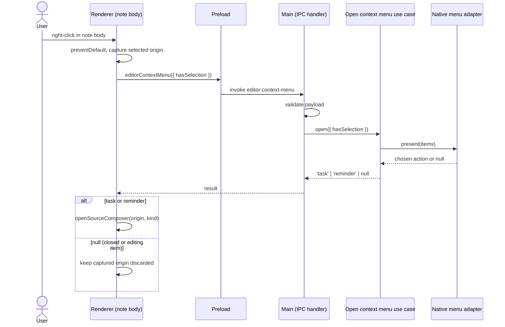

# Specification: Editor Context Menu with Task and Reminder Actions

- **Specification ID**: 005
- **Date**: 2026-10-04
- **Slug**: editor-context-menu-actions
- **Status**: Implemented
- **Owner**: Editor (note body) and page-linked actions (source actions)
- **Related Specification**: [003 — Native Mac Paper Refresh](003-2026-10-04-native-mac-paper-refresh.md)

---

## Context & Background

Page-linked actions (a task or a reminder tied to a passage of a note, kept in `source_actions`) are created today in one way for text: select a passage, then click the task icon at the end of the formatting toolbar, or drag that icon to the margin. The click opens the margin composer with **Tarefa** preselected; the user switches to **Lembrete** inside the composer.

The editor has no context menu. Right-clicking the note body shows nothing, not even the standard Cut/Copy/Paste items. The landing page (`site/`) already illustrates a contextual menu with **Tarefa** and **Lembrete** over a selected passage, which the app does not offer.

Specification 003 sets the direction for macOS-native interaction. This specification adds a native macOS context menu to the note body. The formatting toolbar, the drag-to-margin gesture and the composer stay as they are; the context menu is an additional, redundant path.

---

## Problem Statement

### 1. Right-click does nothing in the editor

On macOS, right-clicking selected text is the expected way to reach actions on it. In the note body, the app swallows the gesture: no menu, no editing items, no way to reach task/reminder creation.

### 2. Creating a reminder takes an extra step

The only entry point opens the composer as **Tarefa**. A user who wants a reminder must open the composer and then switch the kind, although the intent was clear when they started.

---

## Solution

1. Right-clicking inside the note body opens a native macOS context menu (Electron `Menu.popup`) with, in order: **Tarefa**, **Lembrete**, a separator, **Recortar**, **Copiar**, **Colar**, **Selecionar tudo**.
2. **Tarefa** and **Lembrete** are enabled only when a non-empty text selection inside the note body exists when the menu opens. Otherwise they are shown disabled.
3. **Tarefa** opens the existing margin composer with the selected passage and **Tarefa** preselected, exactly as the toolbar icon does today.
4. **Lembrete** opens the same composer with the selected passage, **Lembrete** preselected, the date field visible and focused.
5. Nothing is created from the menu itself; the composer still requires confirmation (**Criar tarefa** / **Agendar lembrete**) and **Esc** still cancels and restores the selection.
6. The editing items use Electron's native roles (`cut`, `copy`, `paste`, `selectAll`) and behave as the **Editar** menu items do.



---

## Practical Gains & Operational Outcomes

1. **Platform conformance**:
   - *Before*: right-click in the note body shows nothing; Cut/Copy/Paste are reachable only through the menu bar and shortcuts.
   - *Now*: right-click shows a native menu with the standard editing items, as in any macOS text editor.

2. **Faster reminder creation**:
   - *Before*: every action starts as a task; reminders need a kind switch inside the composer.
   - *Now*: **Lembrete** opens the composer already in reminder mode with the date field focused.

3. **Discoverability without risk**:
   - *Before*: action creation is only discoverable through a small toolbar icon.
   - *Now*: the context menu always lists **Tarefa** and **Lembrete** (disabled without a selection), and still never creates anything without the composer's confirmation.

---

## User Stories

- [x] 1. As a writer, I want to right-click a selected passage and choose **Tarefa**, so that I can turn it into a task without aiming at the toolbar icon.
- [x] 2. As a writer, I want to right-click a selected passage and choose **Lembrete**, so that the composer opens ready for a date and time.
- [x] 3. As a writer, I want **Tarefa** and **Lembrete** to appear disabled when nothing is selected, so that I learn the feature exists and nothing is created from text I did not choose.
- [x] 4. As a writer, I want **Recortar**, **Copiar**, **Colar** and **Selecionar tudo** in the right-click menu, so that the editor behaves like other Mac text editors.
- [x] 5. As a writer, I want the composer opened from the context menu to behave exactly like the one opened from the toolbar (same quote, same title prefill, **Esc** cancels and restores the selection), so that there is only one way to confirm an action.
- [x] 6. As a writer, I want the formatting toolbar to keep its task icon and drag-to-margin gesture, so that my current habit keeps working.
- [x] 7. As a writer selecting text inside a table cell, I want the same context menu, so that passages in tables can become actions too.
- [x] 8. As a writer, I want closing the context menu without choosing (Esc or click outside) to leave my selection and page untouched, so that right-clicking is never destructive.

---

## Architecture Gate

### 1. Bounded Context & Ubiquitous Language
- **Context**: `editor-context-menu`, a presentation-level context of the Editor that hands off to the existing page-linked actions (source actions) composer.
- **Package Ownership**:
  | Package / module | Responsibility |
  | :--- | :--- |
  | `src/main/editor-context-menu/domain/` | Menu item definitions (ids, labels, order, roles), the `ContextMenuAction` value set (`task`, `reminder`), the rule enabling actions only with a selection, and the `ContextMenuPresenterPort` typedef. Pure, no Electron. |
  | `src/main/editor-context-menu/application/` | `open-editor-context-menu` use case: builds the item list for a request and returns the chosen action (or `null`) through the presenter port. |
  | `src/main/editor-context-menu/infrastructure/` | Native presenter adapter: converts item definitions into an Electron `Menu`, pops it up on the main window, and resolves with the clicked action or `null` when the menu closes. |
  | `src/main/editor-context-menu/presentation/` | `editor:context-menu` IPC handler: validates the payload, calls the use case, returns the result. Registered once. |
  | `src/main/preload.cjs` | Adds one purpose-specific function, `editorContextMenu`. |
  | `src/renderer/editor-context-menu.js` (new) | Renderer UI: `contextmenu` listener on the note body, captures the selected origin, calls the preload function, opens the composer with the chosen kind. No business rules. |
  | `src/renderer/source-actions.js` | `openSourceComposer` accepts an optional initial kind and focuses the date field for reminders. |
  | `src/main/main.cjs` | Wires the adapter into `services` (so the smoke sandbox can replace it) and registers the handler. |
- **Ubiquitous Terms**:
  - `Editor context menu`: the native menu shown on right-click inside the note body.
  - `Context menu action`: `task` or `reminder`, the two items that hand off to the composer.
  - `Editing items`: **Recortar**, **Copiar**, **Colar**, **Selecionar tudo**, implemented by native roles.
  - `Selected origin`: the text origin (`{ kind: 'text', quote, … }`) produced by the existing `selectedOrigin()` for the selection present when the menu opens.
  - `Composer`: the existing margin form that creates a page-linked action after confirmation.

### 2. Aggregate Root & State Transitions
- **Entities & State Machine**: no persisted aggregate is added or changed. The menu request is transient UI state:
  ```mermaid
  stateDiagram-v2
    [*] --> Closed
    Closed --> Open: right-click in note body
    Open --> Closed: Esc / click outside / editing item (result null)
    Open --> ComposerTask: Tarefa (selection present)
    Open --> ComposerReminder: Lembrete (selection present)
    ComposerTask --> [*]
    ComposerReminder --> [*]
  ```
  `ComposerTask` and `ComposerReminder` are the existing composer states; creation and cancellation follow the current source actions behavior unchanged.
- **Invariants**:
  - **Tarefa** and **Lembrete** are enabled if and only if `hasSelection` is `true`.
  - The use case returns only `'task'`, `'reminder'` or `null`; editing items never produce a result value (their roles act natively).
  - The menu never creates, changes or deletes data; only the composer's confirmation does.
  - The origin used by the composer is the one captured at the moment of the right-click, not a selection read after the menu closes.
  - At most one context menu request is in flight; a new right-click while a request is pending is ignored by the renderer.

### 3. Commands, Queries & Domain Ports
```javascript
/** @typedef {'task'|'reminder'} ContextMenuAction */
/** @typedef {{ id: ContextMenuAction, label: string, enabled: boolean } | { role: 'cut'|'copy'|'paste'|'selectAll', label: string } | { type: 'separator' }} ContextMenuItem */
/** @typedef {{ present(items: ContextMenuItem[]): Promise<ContextMenuAction|null> }} ContextMenuPresenterPort */
/** Command: openEditorContextMenu({ hasSelection: boolean }) -> Promise<ContextMenuAction|null> */
```

### 4. IPC Contract & External Input Validation
| Channel | Preload function | Payload | Result | Errors |
| :--- | :--- | :--- | :--- | :--- |
| `editor:context-menu` (`ipcMain.handle`) | `editorContextMenu({ hasSelection })` | `{ hasSelection: boolean }` | `'task' \| 'reminder' \| null` | Rejects with `Pedido de menu inválido.` when the payload is not a plain object or `hasSelection` is not a boolean; rejects when the main window is missing or destroyed. |

- Validation (`unknown` → validation → command) happens in the presentation handler before the use case; unknown fields are ignored.
- The handler only accepts requests from the main window's `webContents` (`event.sender === win.webContents`).
- No other channel is added or changed. Action creation keeps using the existing `notebook:action` flow from the composer.

---

## Implementation Decisions

1. The menu is native (`Menu.buildFromTemplate` + `menu.popup({ window, callback })`), not an HTML popup, following specification 003. Labels are in Portuguese: `Tarefa`, `Lembrete`, `Recortar`, `Copiar`, `Colar`, `Selecionar tudo`.
2. The renderer listens to `contextmenu` on the note body host only (including table cells inside it). Outside the note body, the default behavior (no menu) is unchanged. Textareas inside blocks (diagram code) keep their own behavior and are excluded.
3. On right-click, the renderer calls `preventDefault`, computes `hasSelection` from the current non-collapsed selection inside the note body, captures `selectedOrigin()` when `hasSelection` is true, and then calls `editorContextMenu`.
4. The selection used is whatever the selection is when the `contextmenu` event fires. On macOS, Chromium selects the word under the pointer when right-clicking unselected text in an editable area, as TextEdit and Notes do; that platform selection counts as a selection. The app does not add its own word or line inference. Confirmed by the user on 2026-10-04.
5. The adapter resolves `null` from the popup's close callback when no action item was clicked; an action item click resolves first and the close callback is then ignored.
6. `openSourceComposer(origin, kind = 'task')` gains the optional initial kind. For `reminder`, the composer renders with **Lembrete** checked, shows the date field and focuses it; for `task`, focus and title selection are unchanged.
7. The formatting toolbar, its task icon, its drag gesture and the media card task icon are unchanged.
8. The presenter adapter lives in `services` (`services.contextMenu`) so the smoke sandbox replaces it through `testHook.configure` with a scripted presenter; no test branches enter `src/`.
9. File responsibility limits: each new file has one responsibility and targets ≤ 80 lines; `block-editor.js` (297 lines) is not extended — the listener lives in the new renderer module.
10. Inward dependency rule: `domain/` imports nothing; `application/` imports only `domain/`; Electron appears only in `infrastructure/` and `presentation/`.

---

## Testing Decisions

### Unit Tests (`tests/editor-context-menu.test.cjs`)
- Item list order and labels: Tarefa, Lembrete, separator, Recortar, Copiar, Colar, Selecionar tudo.
- `hasSelection: true` enables both actions; `false` disables both; editing items carry their roles.
- The use case returns what the presenter port resolves (`task`, `reminder`, `null`) and rejects any other presenter value as `null`.
- The IPC payload validator accepts `{ hasSelection: true|false }` and rejects `null`, arrays, strings, missing or non-boolean `hasSelection`.
- The native adapter maps action items to click handlers that resolve their id, maps roles unchanged, and resolves `null` on close without a click (Electron `Menu` replaced by a fake in the test).

### Smoke Tests (extend `source-actions-smoke.js`, scope `--source-only`)
- With a scripted presenter returning `task`: select a passage, dispatch a native right-click; the composer opens with **Tarefa** checked and the passage as quote; confirming creates a task linked to the passage.
- With a scripted presenter returning `reminder`: the composer opens with **Lembrete** checked and the date field focused; confirming with a future date creates a reminder.
- With the presenter returning `null`: no composer opens, the selection and page text are unchanged, no action is created.
- Right-click without a selection: the presenter receives both actions disabled.
- Right-click inside a table cell selection: the composer opens with the cell passage.
- Right-click outside the note body: the presenter is not called.
- No uncaught renderer errors (`window.smokeErrors` empty).

### Error Safety & UI Tests
- A rejected `editorContextMenu` call (invalid payload or missing window) is logged and shown as a readable toast; no raw error text reaches the UI.

### Regression Tests
- Existing unit tests and every smoke scope pass unchanged, especially `--source-only`, `--editor-only`, `--native-only` and selection behavior (toolbar task icon, drag to margin, **Esc** restoring the selection).
- The native **Editar** menu items keep working.

---

## Acceptance Criteria

- [x] 1. Right-clicking inside the note body shows a native menu with Tarefa, Lembrete, separator, Recortar, Copiar, Colar, Selecionar tudo.
- [x] 2. Tarefa and Lembrete are enabled only with a non-empty selection in the note body.
- [x] 3. Tarefa opens the composer as today; Lembrete opens it in reminder mode with the date field focused.
- [x] 4. Closing the menu without an action leaves page, selection and actions unchanged.
- [x] 5. Editing items cut, copy, paste and select all in the note body.
- [x] 6. The toolbar task icon and drag-to-margin keep working.
- [x] 7. The user confirms the menu in the running app (no automated visual inspection).
- [x] 8. All unit, integration, and regression tests pass.
- [x] 9. Quality checks (`npm test` on Node 22+, `node --check` on changed files, affected smoke scopes) pass with 0 errors.

---

## Out of Scope

- Context menus on media cards, link cards, diagrams, the title field, checklist pages (**Tarefas**), the calendar or the sidebar.
- Spellcheck suggestions or dictionary items in the context menu.
- Formatting items (bold, highlight, link) in the context menu.
- Using the word or line under the pointer when nothing is selected (beyond the platform's own right-click selection, see decision 4).
- Changes to the formatting toolbar or the composer beyond the initial kind and focus.
- Updating the landing page illustration.

---

## Further Notes

- Decision 4 (platform right-click word selection counts as a selection) was confirmed by the user on 2026-10-04.
- `docs/USER_GUIDE.md` (**Ações ligadas à página**) mentions the right-click path; `docs/DEVELOPMENT.md` lists the scripted context menu in the sandbox.

### Implementation Record (2026-10-04)
- **Deviation — smoke layout**: the scenario lives in its own file, `tests/editor-context-menu-smoke.js`, driven by `runEditorContextMenuSmoke` in the runner, instead of extending `source-actions-smoke.js`. It runs in `--source-only` and in the full run. The sandbox gains `scriptedContextMenu()` (queued answers; an `Error` answer makes the menu fail). The runner also sends one real right-click through `sendInputEvent`.
- **Detail — reminder default**: opening as **Lembrete** pre-fills the date one hour ahead, the same default the composer already applies when switching from Tarefa to Lembrete.
- **Detail — failure copy**: a failed menu request is logged with context and shows the toast `Não foi possível abrir o menu.`
- **Review follow-up (2026-10-04)**: the smoke scenario now covers a note still in plain textarea mode (selection converted before the menu opens). A native right-click on an unselected word was also tried: in the hidden smoke window Chromium only placed a caret and did not select the word, so the actions arrived disabled. That test was not kept; decision 4 (platform word selection) is unconfirmed and needs checking in the running app.
- **Pending user verification**: acceptance criteria 1, 5 and 7 (native menu appearance, native Cut/Copy/Paste/Select All and the right-click word selection of decision 4) need confirmation in the running app; the item order and roles are covered by unit tests only.
- **Approval**: approved by the user on 2026-10-05. Whether the right-click selects an unselected word (decision 4) in the running app was not reported.
- **Architecture review**: every new file has one responsibility (largest: 20 lines); `domain/` imports nothing, `application/` imports only `domain/`, Electron's `Menu` is injected into the infrastructure adapter and the IPC handler lives in `presentation/`. `block-editor.js` was not extended. No approved exceptions.
- No SQLite schema change and no migration.
