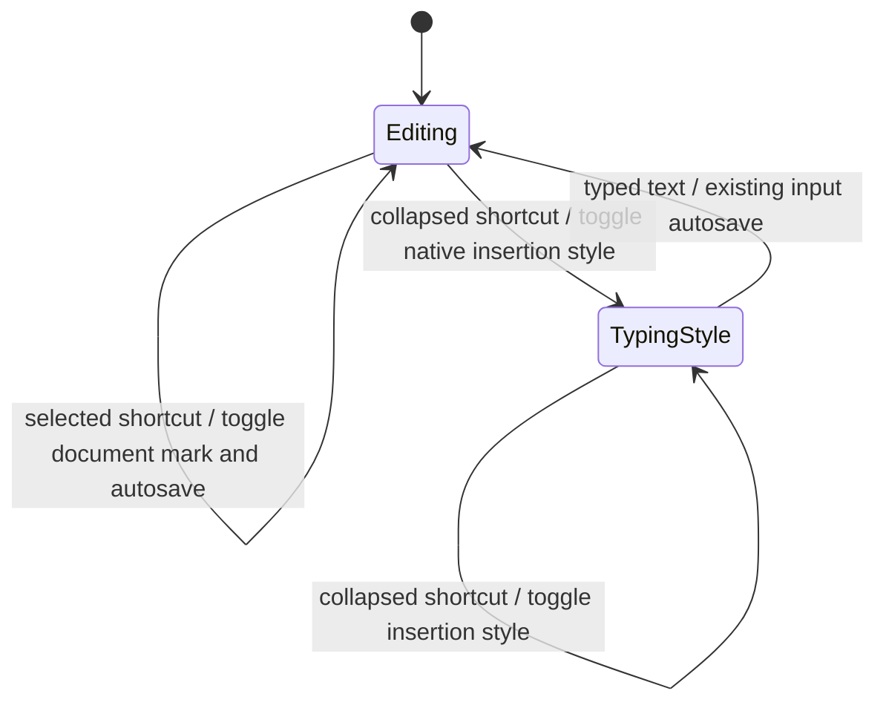

# Specification: Note Editor Formatting Shortcuts

- **Specification ID**: 006
- **Date**: 2026-10-05
- **Slug**: editor-format-shortcuts
- **Status**: Implemented
- **Owner**: Editor
- **Related Specification**: [005 — Editor Context Menu](005-2026-10-04-editor-context-menu-actions.md)

## Context & Background

The note editor already persists bold, italic and underline through its formatting toolbar. Its application keyboard handler has no explicit shortcuts for these commands. Formatting selected text uses the structured run formatter, while collapsed selections currently have no toolbar formatting behavior.

## Problem Statement

Writers cannot reliably invoke the existing persisted formatting commands with Cmd/Ctrl+B, Cmd/Ctrl+I and Cmd/Ctrl+U, including choosing the style of subsequent typing.

## Solution

Add these three keyboard commands inside the editable note body. Follow macOS text editing conventions: toggle the selected passage, or toggle the insertion style at a caret for subsequent typing. Preserve the existing toolbar, autosave and application undo/redo.

## Practical Gains & Operational Outcomes

- Writers format passages without reaching for the toolbar.
- Writers enable or disable a style before typing.
- Keyboard formatting uses the same saved document marks as toolbar formatting.

## User Stories

- [x] 1. As a writer, I can toggle bold, italic and underline with Cmd or Ctrl.
- [x] 2. As a writer, I can apply shortcuts to selected paragraphs and table cells.
- [x] 3. As a writer, I can toggle the style of subsequent typing without a selection.
- [x] 4. As a writer, I can save, undo and redo shortcut formatting.

## Architecture Gate

### 1. Bounded Context & Ubiquitous Language

Extend the existing **Editor** context; this is a presentation gesture, with no new domain model or bounded context.

- **Formatting command**: bold, italic or underline.
- **Selected passage**: nonempty editor selection, including multiple paragraphs or table cells.
- **Insertion style**: Chromium's transient typing attributes at a collapsed caret.
- **Document marks**: existing persisted inline run attributes.

| Package / public module | Ownership and responsibility |
| :--- | :--- |
| `src/shared/editor-document.js` (existing domain model) | Pure structured document and mark normalization; unchanged. |
| Existing Editor application save/history operations | Persist document edits and maintain application undo/redo; unchanged. |
| Existing main persistence infrastructure | Existing note repository and transactions; unchanged. |
| `src/renderer/editor-format-shortcuts.js` (presentation) | Interpret the three keyboard gestures and delegate to existing selected formatter or Chromium insertion style. |
| `src/renderer/index.html` | Load the new renderer script. |
| `tests/selection-smoke.js` | Selected-text keyboard formatting, persistence and history assertions. |
| `tests/smoke/native-editor.cjs` | Actual keyboard events and typed characters at collapsed carets. |

No new four-layer packages are needed: the existing Editor owns all document rules, use cases and adapters. The new module only translates input gestures. It does not implement persistence or business rules.

### 2. Aggregate Root & State Transitions

The existing note document remains the aggregate root. Selection formatting toggles an existing mark: if every selected run has the mark, remove it; otherwise apply it throughout the selection. Other marks and unselected text remain intact.

Invariants: shortcuts act only in the editable note body; nested form inputs and diagram code retain native field behavior. Composing input and Alt-modified gestures are not intercepted. The current selection is used rather than a stale toolbar selection. Native caret attributes produce no empty saved marks or independent undo step; typing is saved through the existing input path. A shortcut must not be applied twice by both the app and the browser.

### 3. Commands, Queries, Domain Events, Use Cases & Ports

- Command: keyboard gesture -> existing `formatSelection('bold'|'italic'|'underline')` for selected text.
- Command: keyboard gesture -> Chromium native formatting command for collapsed carets.
- Query: current editor selection; no new domain query.
- Use cases: existing note update and application history only.
- Events: existing keyboard/input and note save events; no new domain event.
- Ports/adapters: existing note persistence port/preload adapter unchanged. Browser selection and insertion attributes belong to renderer presentation.

### 4. IPC Contract & External Input Validation

No new or changed IPC channels, payloads, validation, preload functions, schema or migrations. Existing `note:update` receives the same structured document marks through the existing save path.

## Implementation Decisions

1. Cmd/Ctrl+B toggles bold, Cmd/Ctrl+I italic, Cmd/Ctrl+U underline.
2. Prevent the browser default only when a supported editor gesture is handled.
3. Convert the initial plain textarea through the existing structured editor conversion, preserving its selection/caret.
4. Keep the listener in a dedicated presentation script; do not grow `block-editor.js` (already over 250 lines).
5. Reuse Chromium typing attributes rather than introducing a parallel persistent insertion-style state machine.
6. Use the existing script lifecycle: one listener per document, no timers or workers.

## Testing Decisions

User confirmed existing Electron smoke seams on 2026-10-05. Follow sequential red/green cycles.

| Layer / seam | Test matrix |
| :--- | :--- |
| Renderer selection smoke | Cmd and Ctrl B/I/U; toggling off; accumulated marks; reverse/multiline selection; table cells; plain textarea conversion; saved public note snapshot; undo/redo. |
| Native keyboard smoke | Actual B/I/U modifier keys; collapsed insertion style on/off; typed text saved with correct marks; unselected surrounding text preserved; fresh plain note. |
| Presentation boundaries | Title and diagram fields excluded; Alt and composition excluded. |
| Domain/application/infrastructure | No changes; run full existing unit/integration suite. |

## Acceptance Criteria

- [x] 1. Selected B/I/U shortcuts toggle persisted marks with both Cmd and Ctrl.
- [x] 2. Collapsed shortcuts toggle the marks of subsequent typing, preserving existing text.
- [x] 3. Multiline/table/plain-note selection, save and undo/redo remain correct.
- [x] 4. Other fields and unsupported modified gestures remain unaffected.
- [x] 5. `npm test`, changed JavaScript syntax checks and affected sequential Electron smoke tests pass on Node 22+.
- [ ] 6. User verifies the shortcuts visually in the running app.

## Out of Scope

Other shortcuts, toolbar redesign, menus, dependencies, IPC changes, schema changes and packaging changes.

## Further Notes

- User confirmed macOS conventions and existing smoke tests on 2026-10-05, requesting only this addition.
- User authorized commit, push and integration through the project Git workflow on 2026-10-05.
- README must be reviewed before completion; record the verdict here.

### Implementation Record — 2026-10-05

- Created the 22-line renderer gesture module and loaded it after the existing block editor.
- Extended the existing selection and native keyboard smoke scenarios; documented the shortcuts in the user guide.
- Red/green evidence: selection shortcuts initially failed on Cmd+B; native caret typing failed on Ctrl+B; focused table controls initially intercepted Cmd+B. Each failing smoke was run before its corresponding implementation change, then rerun successfully.
- Final checks: Node 22.23.1; `npm test` (78 passed), `node --check` on all three changed JavaScript/CJS files, `git diff --check`, and sequential `npm run test:app -- --editor-only` (native, selection and editor scenarios passed, no renderer errors).
- Architecture review: each changed file has one responsibility and remains under 250 lines. The new module translates presentation gestures only; existing domain rules, use cases, persistence and IPC remain unchanged. No new outward dependency, resource service, timer or worker; one document-lifetime keyboard listener. No architecture exception.
- README: reviewed, no change needed. Product descriptions, screenshots, Mermaid diagrams, commands and versions remain accurate; README has no specification index to update.
- Development guide: reviewed, no change needed; the existing smoke commands already cover the added scenarios.
- Deviations: none. Visual confirmation in the running app remains pending; acceptance criterion 6 is unchecked.
- Approval: the user directed commit and push on 2026-10-05 after the implementation report and formal review. Manual visual validation was not reported; acceptance criterion 6 remains unchecked.
- Formal review: no actionable defects or boundary violations found after auditing selection ownership, field focus, native command duplication, history/save behavior, document listener lifetime and unchanged IPC/persistence boundaries.
